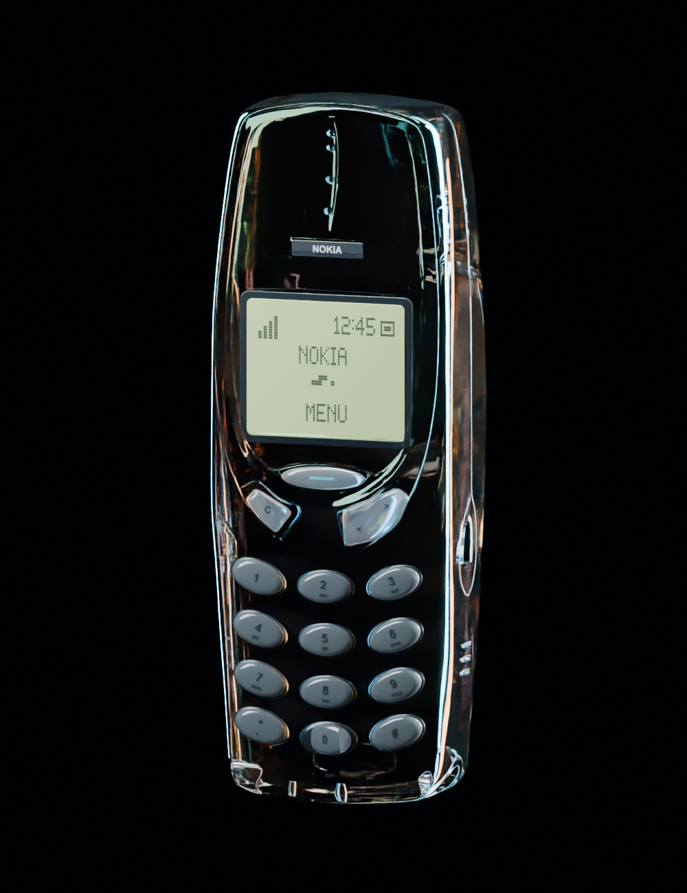
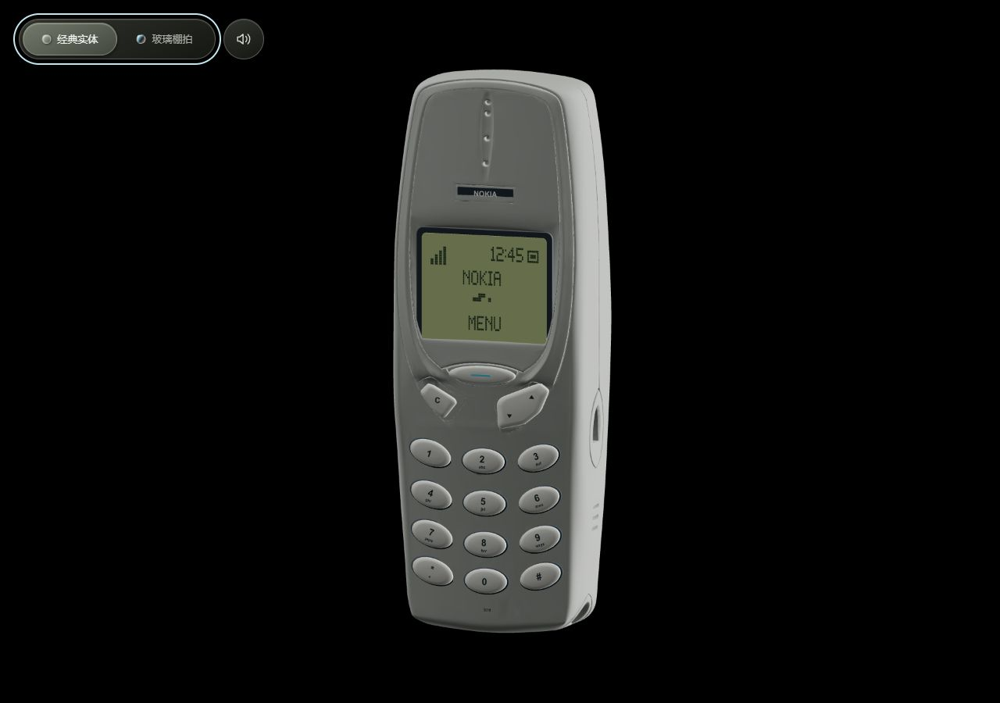
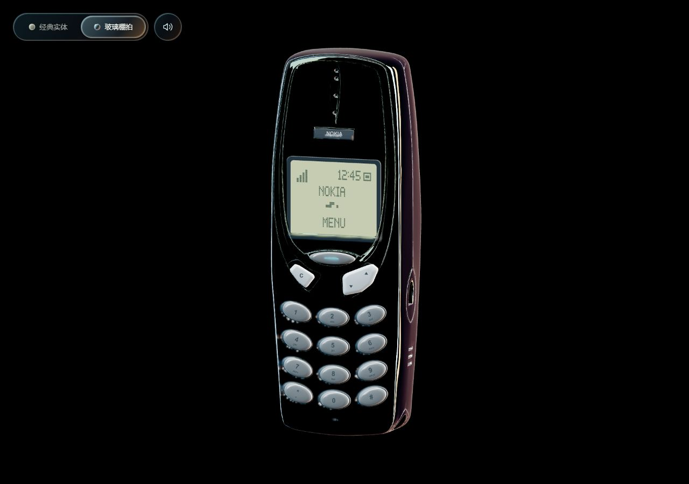
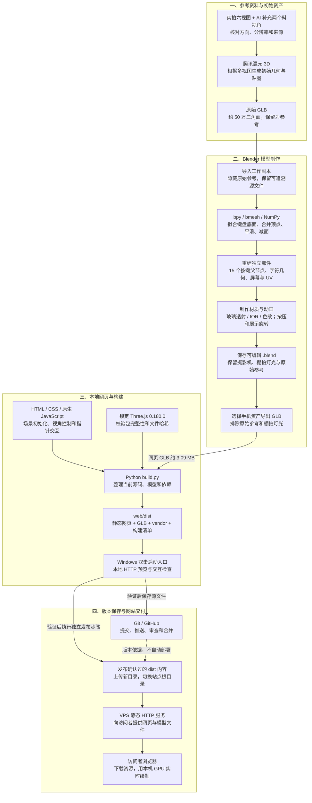
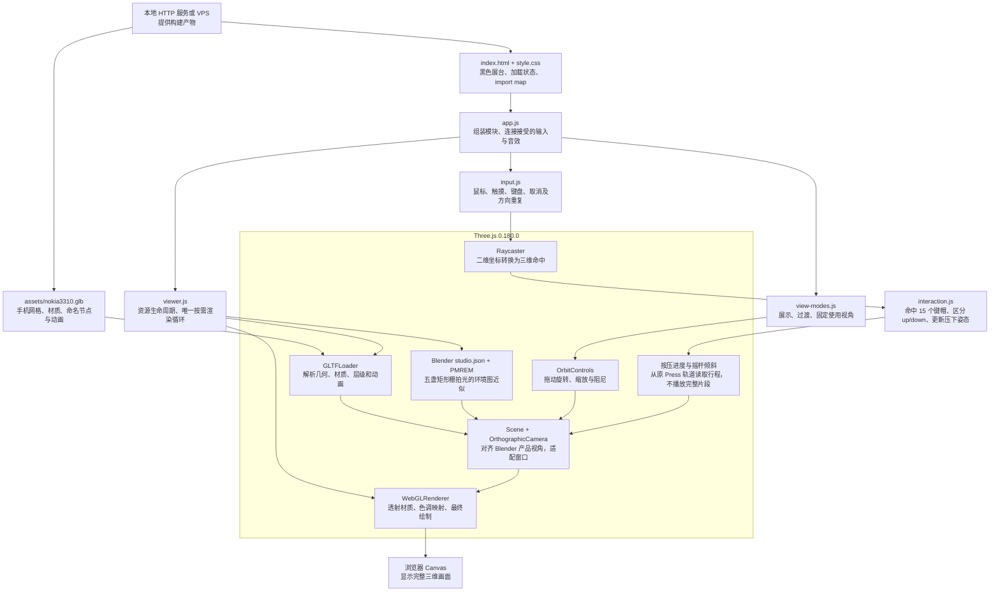
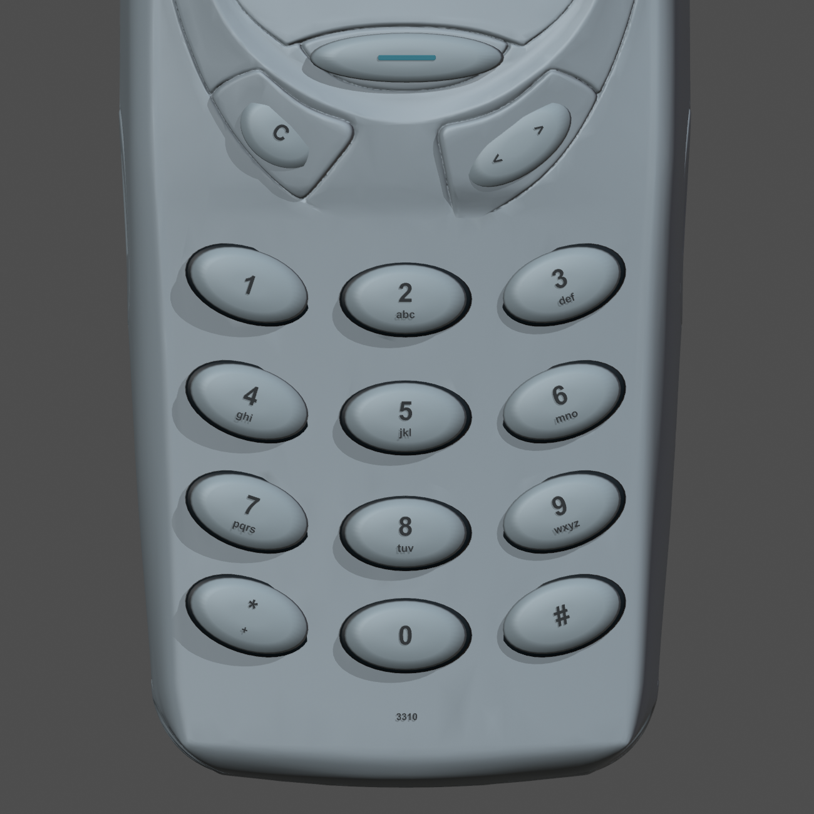
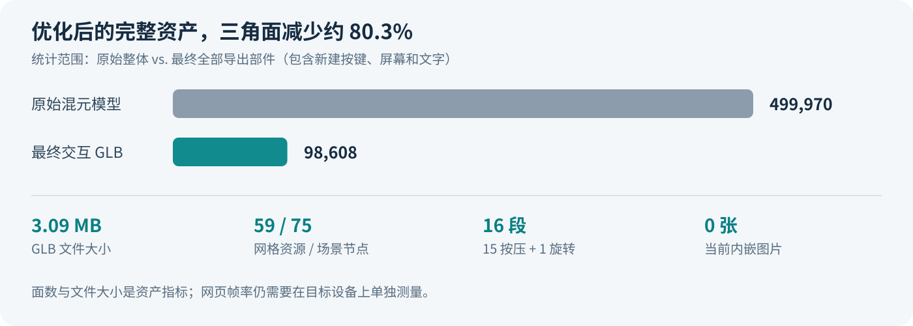
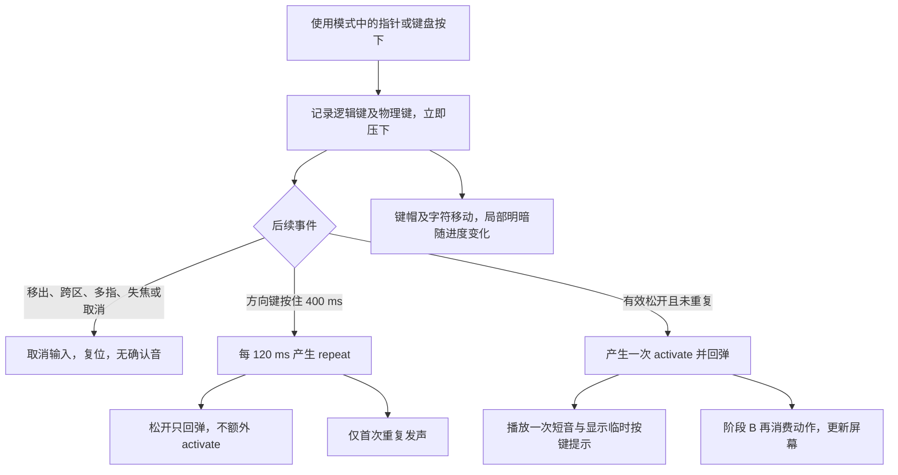
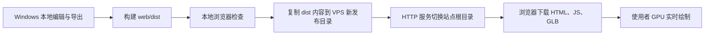
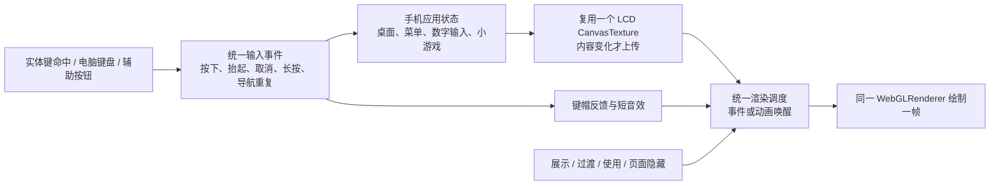

# 复古液态玻璃手机 · 项目总览

以 Nokia 3310 为外形参考，用混元 3D 生成初始模型，在 Blender 中整理几何、玻璃材质和按键动画，再用 Three.js 在浏览器里实时显示与交互。

本文说明整个项目如何组成，以及从图片到网页的处理过程。核对日期：**2026-10-04**。内容依据仓库中的脚本、当前 GLB、网页源码和已有验证记录；网站地址为 [daidainiao.online](https://daidainiao.online/)。v2 模型、两种材质主题和按键反馈已于当日发布，详见 [发布与回退记录](docs/发布记录-20261004.md)。

**本地开发版 `20261004-modes-1` 已完成阶段 A：展示／使用模式与统一输入。尚未部署上线。** 下一阶段接动态屏幕；未来账户、日历、游戏和图片主题的模块边界及 VPS 实测见 [阶段实施与多用户架构规划](docs/阶段实施与多用户架构规划.md)。本次验证及设备限制见 [阶段 A 验收](docs/阶段A验收.md)。



*图 1：v1 的 Blender 渲染参考。新版网页从 Blender 导出棚拍与材质配置，使用实时渲染近似该效果；网页截图见下文。*

**2026-10-04 更新：**当前使用 v2 模型，加入“经典实体 / 玻璃棚拍”滑动开关，修正 C 键与导航键底面的旧凸起，改用 AgX 和同一套棚拍配置，并实现静止时停止渲染。Blender MCP 安装及连接验证见 [安装说明](工具/blender-mcp/README.md)。

按键反馈也已更新：网页行程增加 35%，当前键帽按下时略微变暗并柔化高光；两种主题分别使用短电子音和轻敲击音，主题开关右侧可以静音。




*这两张为材质版本的本地浏览器截图；[线上验收截图](docs/images/production-feedback-20261004.png)与发布记录另行保存。材质主题与“展示 / 使用”模式是两个独立功能。*


*本地阶段 A 截图：按住时键帽保持压下，上下摇杆分别倾斜；屏幕仍是静态外观。*

## 1. 当前做到哪里了

当前本地网页支持**旋转展示和固定角度使用**两种场景。进入页面缓慢旋转，点“开始使用”转到正面；使用时锁定旋转与缩放，按键有可保持的压下、回弹、局部明暗和声音反馈。下一阶段再加入屏幕内容与菜单。

| 能力 | 当前状态 | 具体含义 |
| --- | --- | --- |
| 玻璃机身、独立键帽和清晰字符 | 已有第一版 | 保留 AI 模型轮廓，重建按键和几何文字，仍可继续修形 |
| 拖动旋转、滚轮／双指缩放 | 网页已实现 | 由 `OrbitControls` 控制相机 |
| 经典实体／玻璃棚拍主题 | 网页已实现 | 左上角点击、滑动、空格或方向键切换；共用模型与相机 |
| 15 个物理键、16 个逻辑动作 | 本地已实现 | 射线拾取键帽；从 GLB 轨道读取行程，按住保持，释放回弹 |
| 8 秒一周的展示动画 | 模型内已有，网页未启用 | GLB 含 `Showcase_Rotate`，当前网页没有播放它 |
| 展示／使用模式切换 | 本地已实现 | 自动旋转、暂停、420 ms 过渡、正面锁定及恢复原观察姿态 |
| 屏幕动态内容 | 待接入 | 已有独立屏幕及 UV；当前时钟、文字和像素是静态几何 |
| 按键声音与局部明暗 | 网页已实现 | 短音随主题变化，可静音；仅当前键帽变化，结束后恢复 |
| 数字输入、菜单、小游戏 | 待实现 | 屏幕尚未响应输入 |
| Scroll 上／下两个动作 | 本地已实现 | 按箭头区域区分方向，两端分别倾斜；400 ms 后开始连续输入 |
| 电脑键盘与取消输入 | 本地已实现 | 数字、*、#、↑↓、Enter、Backspace；失焦、移出及多指取消 |

### 在 Windows 上查看

在项目根目录双击 **[启动本地预览.cmd](启动本地预览.cmd)**。脚本会找当前电脑的 Python 环境、构建网页、启动本地服务并打开默认浏览器。默认端口为 8000；不可用时自动选择空闲端口。

保留启动窗口即可继续预览，关闭窗口可以停止。修改源码或重新导出模型后，关闭旧窗口再双击启动，即可重新构建。它没有文件监听或热更新。第一次构建需要下载锁定的 Three.js 包，后续可以使用已校验的缓存。详细命令见 [网页运行说明](web/README.md)。

## 2. 整体流程与技术栈

### 2.1 从参考资料到发布的完整流程

下面的图直接使用 Markdown 内的 **Mermaid 源码**，可以修改节点和连线。它描述当前制作链路；第 7 节及单独的规划文档描述尚未接入的功能。



*图 2A：当前资产制作与交付流程。Blender 负责资产制作；Python 负责文件构建；网站运行时的三维计算在访问者电脑上完成。*

### 2.2 网页运行时的技术关系



*图 2B：当前网页依赖关系。这里的 Canvas 是三维输出画布；后续动态 LCD 会额外使用一个小型二维 Canvas，复用同一个 WebGL 渲染器。*

### 2.3 技术选型与职责

| 层次 | 当前技术 | 在本项目中的职责 |
| --- | --- | --- |
| 初始资产 | 腾讯混元 3D，多视图输入 | 根据照片生成手机外形和初始贴图；当前网页运行时不调用混元 |
| 模型制作 | Blender，项目导入记录为 5.2.2 LTS | 编辑网格、材质、文字、屏幕和动画，保存 `.blend`，导出 `.glb` |
| 建模脚本 | Blender Python：`bpy`、`bmesh`、`mathutils`、NumPy | 表面采样、拟合、减面、生成部件及动画；需在 Blender 环境运行 |
| 网页基础 | HTML、CSS、原生 JavaScript ES Modules | 全屏黑色展台、加载提示、指针事件与资源入口 |
| 三维引擎 | Three.js **0.180.0**，版本与哈希锁定 | 场景、相机、WebGL 实时渲染、物理材质、拾取与动画播放 |
| Three.js 附件与环境 | `GLTFLoader`、`OrbitControls`、`PMREMGenerator` | 加载 GLB、控制视角、烘焙棚拍环境 |
| 构建与本地预览 | Python **3.10+** 标准库 | 整理发布文件、校验依赖、记录哈希、提供本地 HTTP 服务 |
| 版本管理 | Git / GitHub | 保存源码、模型与文档，分支开发和审查合并 |
| 网站承载 | 现有甲骨文 VPS；静态 HTTP 文件服务 | 将 HTML、JS、GLB 等资源发给浏览器，部署方式见第 6 节 |

当前前端没有使用 React、Vue、Vite 或 Node.js 构建链，也没有数据库与手机业务后端。项目建模采用已有 Blender 加项目内 Python 脚本；**这套工程不依赖 Blender MCP**。

## 3. 模型如何从混元版本变成网页资产

### 3.1 图片与原始模型

输入资料在 [混元八视角图片目录](参考资料/Nokia3310_混元输入照片/按混元八视角上传_v2_低于4096/)。正、背、左、右、顶、底六个方向使用实拍图片，左右 45° 为依据实拍补充的 AI 生成图。它们有助于补充外形线索，但不等同于同一实物经过标定的八视图。

图片来源、作者、授权和缩放处理记录在该目录的 [sources.json](参考资料/Nokia3310_混元输入照片/按混元八视角上传_v2_低于4096/sources.json)；实拍来源记录为 Multicherry / Wikimedia Commons / CC BY-SA 4.0。

混元产物保存在 [nokia3310_混元原始.glb](参考资料/nokia3310_混元原始.glb)。导入记录显示它是 **1 个网格对象、499,970 个三角面、1 套材质**，包含 3 张 4096×4096 的打包图像。数字、字母和商标的模糊或错误来自原始生成结果，增加面数本身不能把它们恢复为正确文字。

### 3.2 保留轮廓，整理机身

主要处理脚本是 [构建可交互优化模型.py](Blender工程/脚本/构建可交互优化模型.py)，顺序如下：

1. 在 Blender 中把原始模型保存为隐藏参考，复制一份作为可编辑机身。
2. 用 BVH 射线采样机身正面的高度，在旧按键之间采集表面点，拟合键盘区域的底面。
3. 将原先的按键凸起逐渐压回拟合面，减少旧键形和新键帽重叠的痕迹。
4. 合并重合顶点、修正法线、进行轻度平滑，再用 `Decimate` 保留约 14% 的机身三角面。
5. 在整理后的底面上增加独立按键、文字、屏幕和标牌。

这保留了 AI 网格的整体比例，不是按毫米测量的工业 CAD，也不是完整的四边面重拓扑。后续按键边缘、机身接缝和局部凹凸仍可在 Blender 中继续调整。

### 3.3 重新制作可交互部件

12 个数字／符号键加上 Menu、Clear、Scroll，共 **15 个独立控制父节点**。每个键帽和它的字符挂在同一个父节点下，移动父节点即可让整个键一起按下。数字和字母来自明确的文本，导出前转为网格，因此不再依赖原始 AI 贴图中的错误字符。



*图 3：已有的 Blender 几何与文字检查图，使用便于看清形状的检查材质。它展示部件与文字结构，不代表最终玻璃着色。*

模型的主要关系如下，省略了同类按键和部分装饰：

```text
Phone_Root
├─ Body_Glass_Optimized           玻璃机身
├─ Socket_1                      固定在机身上的按键底座
├─ Key_1                         可移动的按键父节点
│  ├─ Keycap_1                   键帽
│  └─ Digit_1                    数字几何
├─ Key_2
│  ├─ Keycap_2
│  ├─ Digit_2
│  └─ Letters_2                  abc 字母几何
├─ Key_Menu / Key_Clear / Key_Scroll
├─ Screen_Frame                  屏幕边框
├─ Screen_Display                带 UV 的显示表面
│  └─ Screen_Preview_Pixels      当前静态点阵
└─ Nokia_Badge / Nokia_Legend     标牌与文字
```

`Screen_Display` 已有 0～1 的 UV 坐标与 84×48 的逻辑屏幕尺寸元数据，为将来替换成 `CanvasTexture` 预留了位置。当前 `12:45`、`NOKIA`、`MENU` 等内容由 `Screen_Preview_Pixels` 的小面片构成，并没有运行中的时钟或菜单。接入动态屏幕时需要隐藏这份静态点阵。

### 3.4 材质与动画

玻璃机身采用 Principled BSDF，当前导出参数包括：粗糙度约 **0.05**、透射 **1.0**、折射率 IOR **1.47**、厚度参数 **0.16**、色散参数 **0.8**。键帽粗糙度约 **0.14**、透射约 **0.88**，材质更偏磨砂。厚度是模型材质参数，不能直接解释为实测厘米或毫米。

GLB 内包含 `KHR_materials_transmission`、`KHR_materials_volume`、`KHR_materials_ior`、`KHR_materials_dispersion` 和 `KHR_materials_clearcoat` 扩展。薄膜与五盏棚拍灯另由 [导出脚本](Blender工程/脚本/导出网页棚拍配置.py) 写入 `web/assets/studio.json`：网页补回 420 nm 薄膜参数，并从同一组灯的位置、方向、尺寸、功率和颜色生成环境反射。GLB 本身仍不携带摄影棚。

v2 的 C 键和导航键使用独立细磨砂材质：粗糙度 0.26、透射 0.42；原机身该区域的 3,302 个顶点沿连续底面调整，保持封闭网格，并给按压过程留出间隙。网页版使用屏幕空间折射，机身有效光程校准为 0.035、键帽为 0.0075，以减轻前景字符与键帽重影。这是针对实时渲染的校准，不能当作实物厚度，也不代表与 Cycles 逐像素相同。

每个 `Key_*` 都有对应的 `Press_*` 动画。按键动画在 30 fps 下使用第 1、4、8、12 帧控制“原位 → 按下 → 短暂保持 → 原位”，总时长约 **0.367 秒**。数字键行程为 **0.004 个模型单位**，三个功能键为 **0.003**。另有 `Showcase_Rotate`，8 秒旋转一周。工作工程的 NLA 动画轨道默认静音，导出时临时启用。

上述数值是 GLB 原始动画。网页加载后克隆按压轨道，以各键原位为中心把位移乘以 `PRESS_TRAVEL_SCALE = 1.35`，得到数字键约 **0.0054**、功能键约 **0.00405**。不缩放绝对坐标，不修改原 GLB，也不放大键帽尺寸。

### 3.5 导出与体积

当前编辑工程为 [Nokia3310_交互优化_v2.blend](Blender工程/Nokia3310_交互优化_v2.blend)，网页资产为 [nokia3310_interactive_v2.glb](Blender工程/网页模型/nokia3310_interactive_v2.glb)。v1 与原始参考均保留。导出只选取手机资产，排除隐藏原始参考、摄影机与棚拍灯光，同时应用修改器、保留命名、附加属性和动画。



*图 4：比较原始整体与最终 GLB 的三角面；最终值包含新建按键、文字等全部导出部件。数据来自导入记录与当前 GLB，不能据此直接推算帧率。*

| 指标 | 当前值 | 说明 |
| --- | ---: | --- |
| 原始模型三角面 | 499,970 | 导入记录 |
| 减面后的机身 | 69,992 | 只计算机身，不是完整资产 |
| 最终导出三角面 | 98,608 | 比原始整体减少约 80.3% |
| GLB 文件大小 | 3,087,660 字节 | 约 3.09 MB，或 2.94 MiB |
| 网格 / 节点 | 59 / 75 | 网格是几何资源，节点还包括父子变换等结构 |
| 动画片段 | 16 | 15 个按键动画 + 1 个展示动画 |
| 内嵌图片 | 0 | 当前玻璃版以几何和材质构成，不包含原始三张大贴图 |

文件变小同时受减面和替换大贴图影响。`.blend` 仍保留原始参考等编辑内容，因此明显大于 GLB 属于正常情况；网页只加载导出的 GLB。

## 4. 模型如何进入网页并显示

### 4.1 构建只整理资产

[web/build.py](web/build.py) 读取十个前端源码文件、棚拍 JSON 和当前 GLB，取得锁定版本的 Three.js，校验依赖后生成 19 份运行资源及构建清单：

```text
web/dist/
├─ index.html
├─ style.css
├─ app.js
├─ viewer.js / view-modes.js / input.js
├─ interaction.js
├─ appearance.js / theme-switch.js
├─ key-sound.js
├─ assets/studio.json
├─ assets/nokia3310.glb
├─ vendor/three/…                6 份运行时 JS 和 MIT 许可证
└─ build-manifest.json           本次文件大小、SHA-256 与版本记录
```

构建不会运行 Blender，不会替模型减面，也不会把 `.blend` 自动转换为 GLB。模型有变化时，需要先从 Blender 重新导出，再构建网页。

[dependencies.lock.json](web/dependencies.lock.json) 只锁定第三方依赖，日常修改源码和模型不需要改它。历史发布记录单独放在 [20261003-black.json](web/release-snapshots/20261003-black.json)，只有显式传入 `--verify-snapshot` 才要求当前运行资源与旧发布版完全一致。

### 4.2 浏览器加载与实时渲染

页面通过 import map 解析 Three.js 模块，[web/app.js](web/app.js) 负责组装，[web/viewer.js](web/viewer.js) 负责三维资源：

1. 创建 `WebGLRenderer`、黑色背景的 `Scene` 和与 Blender 产品摄影一致的正交相机。
2. 并行加载 `/assets/studio.json` 和 `/assets/nokia3310.glb`，将模型居中。
3. `appearance.js` 按五盏灯生成彩色／中性环境图，各烘焙一次；两套材质共用几何。
4. 按宽高比调整相机视锥，窄屏为左上角控件留出空间。
5. 展示模式由 `OrbitControls` 驱动自转与拖动；过渡由 `view-modes.js` 单独管理相机；使用模式固定姿态。
6. 事件、相机运动、过渡和按键进度合并到一个请求帧入口。静止使用、暂停展示及稳定按住时停止绘制，隐藏／失焦时暂停并取消输入。

当前网页使用 sRGB 输出、**AgX** 色调映射和曝光 1。DPR 上限 **1.5**，透射目标分辨率比例 **0.65**；玻璃环境强度 1，实体环境强度 0.8，实体材质不透射、无自发光。静止时停止请求帧，页面隐藏时停止绘制，返回时重新请求一帧。主题切换只更换材质与环境图，不重载模型、不重置视角。

玻璃反射色彩由**模型材质、环境图、灯光颜色／强度、曝光和色调映射共同决定**。后续调整色彩时，可以先确定要改变的是机身材质还是网页照明，再修改相应位置。

## 5. 轻触按键时发生了什么

### 5.1 从鼠标／手指坐标找到三维按键

二维点击坐标先被转换为 Canvas 内的归一化坐标：

```text
x =  2 × (clientX - canvasLeft) / canvasWidth  - 1
y = -2 × (clientY - canvasTop)  / canvasHeight + 1
```

`Raycaster` 只检测 15 个实际键帽，不遍历整个高面数机身。`interaction.js` 将键帽映射到 `Key_*` 父节点。命中摇杆时，把交点转换到摇杆自身坐标，依据实际 `Legend_Up`、`Legend_Down` 的位置判定上下方向；中央很窄的边界区不产生输入。拾取只在固定正面的使用模式生效。

### 5.2 区分轻触、拖动和双指手势



*图 5：当前代码的按键事件流程。整体架构、交付和事件流程均采用 Mermaid；图 1、图 3 为模型图片，图 4 为资产统计插图。支持 Mermaid 的 Markdown 阅读器可以直接渲染流程图，也可以直接编辑代码块维护它们。*

指针移动超过 12 px、离开原逻辑键或跨过摇杆分区，都会取消该次操作，即使后来移回来也不提交。出现第二个触点后取消输入，直到全部手指抬起才重新接受。键盘只在手机画布聚焦时生效，保留 Tab 与浏览器组合快捷键；原生按键重复由统一的方向重复规则接管。

### 5.3 从模型动画提取行程，控制可保持的姿态

[createKeyFeedback()](web/interaction.js) 从每段 `Press_*` 的位移轨道读取最深行程，保持原始轨道不变，再把数字键及普通功能键的行程放大为 1.35 倍：

| 物理节点 | 行程参考 | 随它移动的内容 |
| --- | --- | --- |
| `Key_2` | `Press_2` | 键帽、数字 2、字母 abc |
| `Key_Star` | `Press_Star` | 星号键及字符 |
| `Key_Menu` | `Press_Menu` | 中间导航键和青色短条 |
| `Key_Scroll` | `Press_Scroll` | 整个右侧摇杆及上下符号 |

每个键保存初始位置与旋转，以及 0～1 的压下进度。按下时趋近 1，松开时趋近 0，收敛后精确复位。摇杆共用一个实体，在原行程基础上减小中央平移，并绕箭头中点施加正负 0.10 弧度的倾斜，使被按的一端下沉。GLB 的完整按压片段和旋转片段不同时参与驱动。

`input.js` 输出 `down / up / cancel / activate / repeat`。`app.js` 连接视觉、声音与临时状态提示，后续应用只消费 `activate / repeat`，避免同一按键被计算两次。页面底部会短暂显示“↑ 向上”等提示，LCD 此时仍是静态几何。

每个键帽拥有可复用的两套材质实例，避免修改共享材质时整排键一起变暗。按压最深时，实体主题的线性基色降低约 16%，玻璃主题约 22%，并稍微提高粗糙度；这是材质参数变化，不等于屏幕像素亮度按同比例降低。回弹后恢复基准值，主题切换过程中仍保持当前按压程度。

`key-sound.js` 用 Web Audio 合成短音：实体主题约 75 ms 的柔和电子音，玻璃主题最长约 85 ms 的轻敲击音。音频上下文在用户手势中创建／恢复，有效松开或首次方向重复时响一次；后续重复不逐格响。拖动、多指和取消不提交声音。装配层保存本机静音偏好；音源结束后断开，最多四声部，空闲 800 ms 后挂起上下文。依据 [AudioContext.resume 文档](https://developer.mozilla.org/en-US/docs/Web/API/AudioContext/resume)处理异步恢复，过晚恢复的点击不补播。音频不可用时，视觉反馈继续工作。

这一拾取实现依赖“固定正面使用”约束。如果将来开放侧面使用或更换模型，需要重新检查遮挡和热区，不能直接假设任意相机角度都适用。

## 6. 如何发布到网页端

本项目的网页产物是静态文件。现有域名使用用户的甲骨文 VPS；仓库保留了 2026-10-03 与 2026-10-04 两次发布的文件哈希。当前部署记录见 [2026-10-04 发布与回退](docs/发布记录-20261004.md)，以下说明通用发布链路。



推荐的更新顺序是：保存模型和代码 → 本地构建检查 → 提交／推送分支并合并 → 上传确认过的 `web/dist/` 内容 → 切换发布目录 → 检查线上页面与资源，保留上一发布目录便于回退。**代码推送和网站发布是两个独立动作**，当前仓库没有自动部署工作流。

页面使用 `/assets/…` 和 `/vendor/…` 这样的根路径，因此应把 `dist` **内部内容**放在域名的站点根目录。若使用 Caddy，站点块可以按下面的形式配置；这是说明示例，路径需按实际服务器确认，不是线上配置的备份：

```caddyfile
daidainiao.online {
    root * /var/www/nokia3310/current
    encode zstd gzip
    file_server
}
```

服务器只需要提供构建产物，不需要安装 Blender，也不需要为每个访问者重新渲染手机。访客首次访问会下载模型与脚本，交互和动画期间由访客设备的 GPU 计算玻璃效果，静止后停止绘制。服务器压力主要来自并发下载、带宽与 HTTP 请求；用户端压力则来自渲染分辨率、透射材质、几何与绘制次数。3.09 MB 只代表 GLB，不是整站总下载量。

## 7. 后续改进应该改哪里

完整方案见 **[阶段实施与多用户架构规划](docs/阶段实施与多用户架构规划.md)**。模式与输入已在本地完成；下一步添加应用状态和动态 LCD。性能细节仍可参考 [按键、屏幕与性能规划](docs/交互与性能规划.md)。

建议继续使用原生 JavaScript 和已有 Three.js，用**一套模型、一套三维渲染器、一个低分辨率 LCD 画布和一个轻量应用状态**接入功能。优先完成“输入一个数字，按键动一下、屏幕出现数字、响一声”的闭环，再增加菜单和小游戏。



*图 7：建议的后续交互结构。当前按压功能保留为基础，屏幕内容和声音通过同一套输入事件联动。*

下一阶段先接桌面时钟、菜单、数字输入与设置；再扩展日历、贪吃蛇和图片主题。邮箱与用户上传手机模型不在当前范围。功能先在浏览器内运行，账户与同步单独实现。

性能优化应先区分两个目标：**停止无意义的重绘主要节省计算与功耗；降低渲染目标尺寸、控制纹理数量和资源复用才直接影响内存。** 当前 GLB 的动画缓冲数据合计仅 7,028 字节，删除这些动画不是优先项。玻璃透射带来的额外渲染目标和全屏像素数更值得先测量。

| 想改的内容 | 主要入口 | 后续还需要什么 |
| --- | --- | --- |
| 键帽形状、字符位置、接缝 | `Nokia3310_交互优化_v2.blend` | 导出新 GLB，保持 `Key_*` 和 `Press_*` 对应关系 |
| 玻璃自身的粗糙度、透射、IOR、厚度 | Blender 材质 | 导出后在网页实际观察，不能只看 Blender 图 |
| 反射的环境色、灯光与曝光 | `studio.json`、`web/appearance.js` | 从 Blender 更新配置，在网页比较正面和侧面 |
| 展示时旋转，使用时固定 | `web/view-modes.js` | 已实现；可在此调整速度、过渡和固定视角 |
| 动态屏幕和菜单 | `Screen_Display` + 新的屏幕逻辑 | 隐藏静态像素，绑定 CanvasTexture，按键更新屏幕状态 |
| 按键声音 | `web/key-sound.js` | 可继续调整音量、包络与音色，保持静音和误触过滤 |
| 上／下导航 | `web/interaction.js`、`web/input.js` | 已区分方向；下一阶段把 accepted action 接到菜单 |
| 更流畅的预览 | 网页渲染循环与 GLB | 测量设备帧耗时，再调整像素比、材质、绘制次数或空闲策略 |

展示自转由 OrbitControls 驱动，GLB 的 `Showcase_Rotate` 保留但不播放。使用时固定角度；返回时恢复原来的展示姿态。系统减少动态效果偏好会关闭自动旋转并缩短过渡。

Blender 离线／视口渲染与网页实时渲染使用不同的渲染路径，Blender 中卡顿不能直接推出网页同样卡顿。现有结构已经降低了面数并限制了像素比，但透明材质和持续绘制仍可能成为较弱设备的负担；当前没有真实手机端帧率基准。

## 8. 目录导航与验证依据

```text
复古液态玻璃手机/
├─ README.md                     本文：项目整体说明
├─ 启动本地预览.cmd               Windows 双击启动入口
├─ docs/
│  ├─ 交互与性能规划.md            后续功能、接入方式与优化计划
│  └─ assets/                    文档统计插图等辅助资源
├─ 参考资料/                     实拍、AI 补充视角、原始混元 GLB
├─ Blender工程/
│  ├─ Nokia3310_导入工作副本.blend
│  ├─ Nokia3310_交互优化_v1.blend / Nokia3310_交互优化_v2.blend
│  ├─ 网页模型/                  网页使用的 GLB
│  ├─ 脚本/                      导入、建模、分析、验证
│  └─ 优化检查/                  既有渲染图和验证记录
└─ web/
   ├─ README.md                  构建、预览与发布命令
   ├─ index.html / style.css      页面与样式
   ├─ app.js                     模块装配及接受的动作回调
   ├─ viewer.js / view-modes.js   三维资源、调度、模式与相机
   ├─ input.js / interaction.js   统一输入、命中与键帽反馈
   ├─ appearance.js / theme-switch.js 材质、棚拍与主题控件
   ├─ key-sound.js               轻量按键音与静音状态
   ├─ build.py                   静态构建与本地 HTTP 服务
   ├─ dependencies.lock.json      第三方依赖锁定
   ├─ release-snapshots/          历史发布文件哈希
   ├─ tests/                     构建逻辑测试
   └─ dist/、.cache/              本地产物与缓存，不提交 Git
```

本次验证 v2 GLB：98,608 个三角面、59 个网格、75 个节点、16 段动画、0 张内嵌图片和 3,087,660 字节；SHA-256 为：

```text
bd13712fb9ce218dd6081a5acb382d517e7133213d4e443a4dd45c068ae39527
```

更细的依据可以从以下位置继续阅读：

- [导入报告](Blender工程/导入报告.json)：原始网格、贴图、尺寸与 Blender 版本记录。
- [建模脚本](Blender工程/脚本/构建可交互优化模型.py)：减面、部件、材质、动画和导出逻辑。
- [模型验证记录](Blender工程/优化检查/交互模型验证.json)：当时的主要实体封闭性、UV、动画行程和回位检查。这份记录早于网页接入，里面的“未进行浏览器验证”描述属于当时建模阶段。
- [网页源码](web/app.js) 与 [按键逻辑](web/interaction.js)：当前网页实际启用的显示与交互能力。
- [网页说明与测试](web/README.md)：构建使用方法、历史网页检查记录及本地构建测试。

v2 材质与反馈发布的历史依据：[模型结果](Blender工程/优化检查/v2交互模型验证.json)、[网页结果](web/tests/browser-validation.json)、[按键反馈结果](web/tests/feedback-validation.json)、[线上发布验收](web/release-snapshots/20261004-feedback.json)。当前阶段 A 本地版另见 [验收说明](docs/阶段A验收.md) 和 [诊断记录](web/tests/phase-a-validation.json)。没有重新生成 Cycles 离线渲染图或进行真实手机 GPU 性能测试；资源计数不等同于整个进程的内存。

**维护提醒：**手动精修过 `.blend` 后，不要直接重跑生成脚本覆盖成果；先另存一个新版本。每次更新模型或交互逻辑，也同步更新本文的指标、截图和“已实现／待实现”状态。
