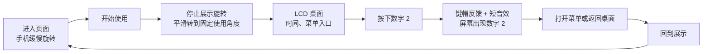
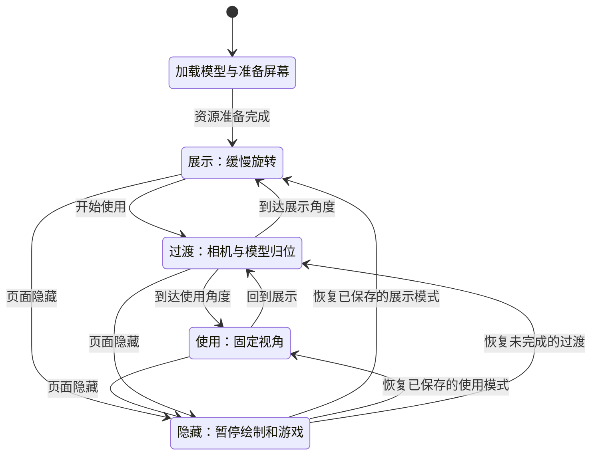
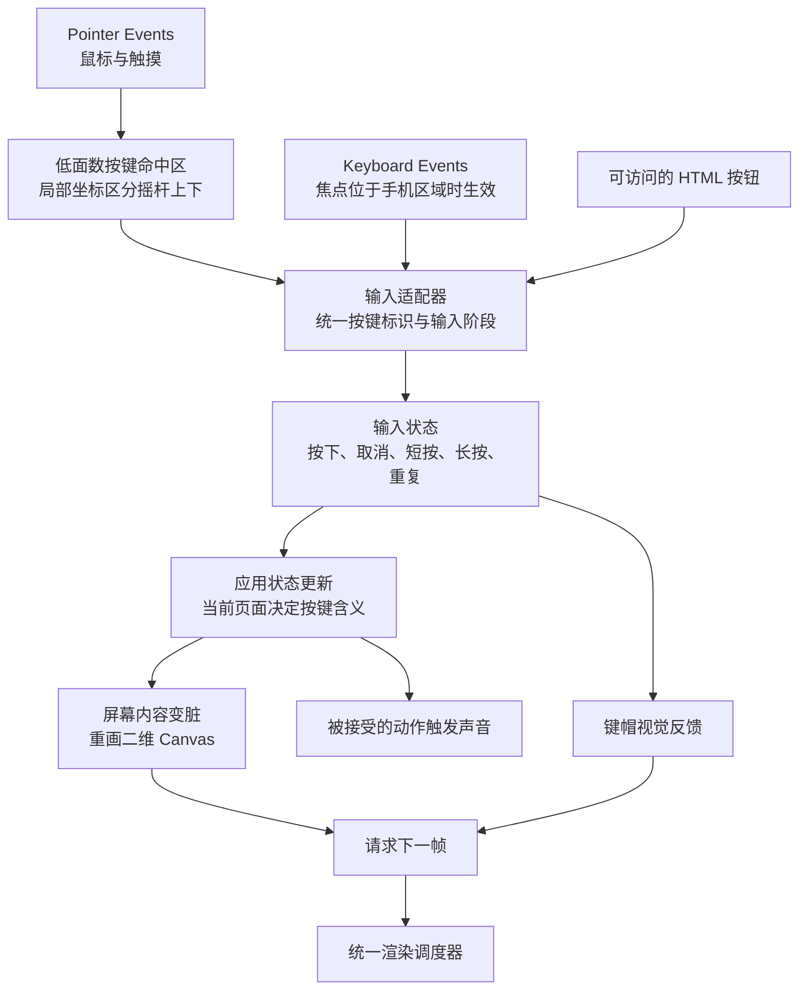
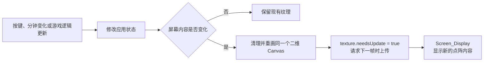
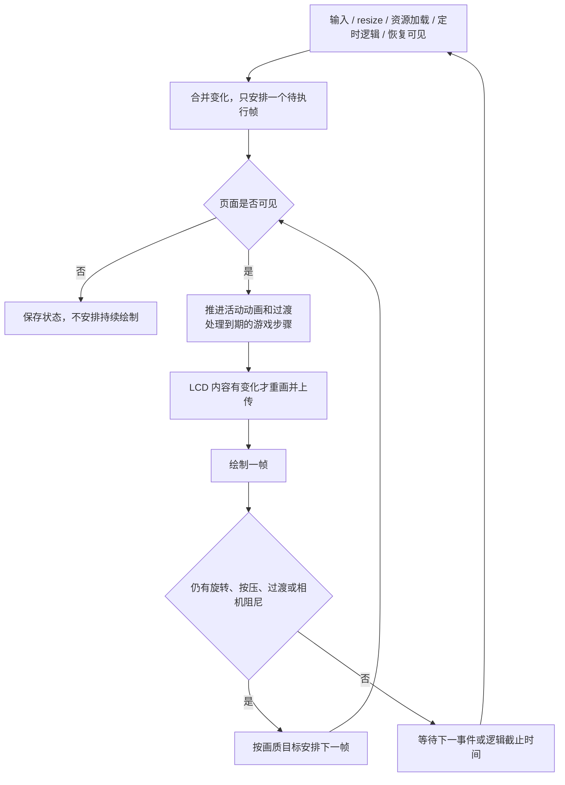

# 液态玻璃手机：按键、屏幕与性能规划

更新时间：**2026-10-04**。返回 [项目总览](../README.md)。

本文保留后续实现方案。当前本地已完成阶段 A：展示／使用模式、按住与回弹、上下方向输入、主题短音、静音和按需渲染；动态 LCD 与菜单仍待实现。本地版尚未部署，实测证据见 [阶段 A 验收](阶段A验收.md)。未落地部分的参数是实验起点，不代表已达成的帧率或内存指标。

2026-10-04 后续确认：先完成展示／使用和输入，再做屏幕；多用户与设置、日历、小游戏、图片主题按独立阶段接入。具体模块边界、最新交互顺序和 VPS 实测见 [阶段实施与多用户架构规划](阶段实施与多用户架构规划.md)，有不同阶段安排时以该文为准。

## 1. 推荐方向与第一版体验

沿用**原生 JavaScript + Three.js**，把手机做成一个小型交互产品：外部保持玻璃展品的视觉，内部用复古点阵界面呈现可操作的内容。功能通过少量状态和事件驱动，避免为每个应用创建新的三维场景、模型、渲染器或屏幕纹理。

建议第一条完整使用路径是：



这里保留少量模型外的 HTML 控件：“开始使用／回到展示”“静音”“画质”。它们提供清晰入口，也能用键盘访问。手机内部仍通过实体模型按键操作；页面没有额外的大型控制面板。

第一版不需要后台服务。设置和最高分可用少量 `localStorage` 数据保存，设置写入发生在操作完成后，不放在每帧循环。存储不可用时继续运行本次会话。

## 2. 一份资源，两种场景

### 2.1 模式状态机



恢复路径由隐藏前保存的模式决定，不同时触发。恢复游戏时显示暂停状态，由用户继续；恢复时钟则从系统时间重新计算。切回页面不会补播声音或把隐藏期间的游戏步骤一次性执行完。

### 2.2 各模式约定

| 状态 | 手机与相机 | 按键与屏幕 | 绘制策略 |
| --- | --- | --- | --- |
| 展示 | 缓慢自转，可允许短暂拖动观察 | 屏幕显示桌面；实体按键暂不执行应用动作 | 持续有运动，按目标帧率绘制 |
| 过渡 | 约 300～500 ms 平滑归位，时长待视觉调试 | 清空按住状态，暂不接受新的应用输入 | 动画期间绘制，结束切换模式 |
| 使用 | 禁止拖动旋转，第一版连缩放也固定，保证按键位置稳定 | 实体键、电脑键盘和辅助控件映射到相同动作 | 静止时休眠，输入或屏幕变化时唤醒 |
| 隐藏 | 保存当前模式与视角 | 取消按住、长按和声音；游戏暂停 | 不进行应用主动绘制 |

模型只加载一次，切换模式不重新请求 GLB、不销毁重建场景。

### 2.3 避免旋转互相覆盖

阶段 A 已统一观察姿态的所有者：`OrbitControls` 负责展示相机，GLB 中的 `Showcase_Rotate` 保留但不播放；`view-modes.js` 只在过渡期间负责相机姿态。

1. 进入使用前保存展示相机的位置、目标点与缩放。
2. 取消当前拖动，清空控制器残留阻尼；随后关闭 OrbitControls 输入。
3. 以球坐标短路径插值相机方向、距离、目标点和缩放，避免相机穿过模型；默认过渡 420 ms。
4. 到位后应用精确目标，使用时固定正面与缩放；回到展示时恢复保存的姿态。
5. 展示约 60 秒一周；拖动期间停止自转，结束 1.2 秒后恢复。用户主动暂停或系统减少动态效果时不自动恢复旋转。

保留 GLB 旋转片段用于资产编辑，不在网页同时驱动根节点。该选择使控制关系清楚，不能据此宣称显著减少模型内存。

## 3. 把按键动画接入应用

### 3.1 模块关系



建议输入接口采用少量结构化事件，例如：

```text
key-down / key-up / key-cancel       输入生命周期
key-short / key-long / key-repeat   确认后的动作
key: 0..9、star、hash、menu、clear、up、down
source: pointer、keyboard、accessible-button
```

`up`、`down` 是两个逻辑按键，共用物理节点 `Key_Scroll`。模型里仍然只有 15 个可移动部件。不要根据材质名或网格排列顺序猜测按键，继续使用稳定的 `Key_*` 标识。

### 3.2 短按、长按和按住反馈

原先超过 700 ms 就排除的点击识别已替换。当前普通键可以一直保持压下，在有效松开时确认一次；方向键采用 400/120 ms 重复规则。未来“长按 C 回桌面”需在统一输入层增加明确阶段，不在业务层另外启动一套计时器。

本次确认的输入阶段直接加入更接近实体键的按住效果：按下时进入压下位置，松开时回弹。可从现有 `Press_*` 轨道读取方向与行程，再用每个键一个标量进度控制父节点；同一个节点不再同时播放旧按压动画和手动位移。短按业务动作只确认一次，上下导航重复后释放不追加短按。屏幕在后一阶段消费这些事件。

长按建议从 500 ms 起试验，只对 C、方向键等明确支持的键启用；导航重复建议在 400 ms 后开始，以约 120 ms 间隔移动一格。二者是不同规则。长按成功后抑制随后的短按，方向重复由一个调度器统一维护，不为每个键各开一组永久定时器。

每个 pointerId 记录独立状态；指针取消、丢失捕获、浏览器失焦、模式切换和页面隐藏时，统一释放键帽、取消待触发动作并停止短音。电脑键盘输入同样有释放处理，忽略浏览器原生 `event.repeat`，由应用自身决定重复节奏。避免吞掉 Ctrl、Alt、Meta 组合键和普通表单输入。

### 3.3 更轻的命中检测

当前射线会遍历整部约 9.9 万三角面的手机；虽然只在按下和抬起时运行，优先级低于持续渲染，但可以简化：为每个键准备低面数平面或盒体，放入单独的拾取列表，并保存逻辑按键 ID。它们是运行时命中代理，不参与可见画面绘制。

只在使用模式启用业务拾取，正面固定后可避免从背面误按。摇杆命中点转换到摇杆局部坐标，再按上下区域映射；依据实际导出后的轴向校准，不能直接照搬 Blender 的 Z 轴。扩大手机端热区时要保证邻接键不重叠，不能只把所有盒子同时放大。

若未来允许使用中旋转，还需补充正面朝向和遮挡判定。第一版无需引入完整物理引擎或 BVH 库。

### 3.4 第一版按键映射

| 实体／键盘 | 桌面 | 菜单 | 数字输入 | 贪吃蛇（第二阶段） |
| --- | --- | --- | --- | --- |
| 数字 0～9 | 打开数字输入，保留刚按的数字 | 首版不绑定菜单快捷号 | 追加数字 | 2/4/6/8 控制方向，其余忽略 |
| Menu / Enter | 打开菜单 | 确认所选项 | 打开“清空／返回”等操作菜单 | 开始或暂停 |
| C / Backspace | 保持桌面 | 返回上一层 | 删除末位数字 | 退出确认 |
| 长按 C / Escape | 回到桌面 | 回到桌面 | 回到桌面 | 暂停并返回桌面 |
| Scroll 上／下 / 方向键 | 首版不切换页面 | 上一项／下一项 | 首版不移动光标 | 键盘四方向可用；实体摇杆仅上／下 |
| 星号／井号 | 进入数字输入 | 首版无动作 | 输入 `*` / `#` | 首版无动作 |

Menu 是上下文软键，LCD 底部显示当前含义。数字输入限制长度，例如 32 个字符。它是交互演示，不发起真实呼叫；界面应使用“数字输入”等准确名称。第一版不做短信多击输入和 T9，先把反馈与导航做顺畅。

## 4. 动态屏幕如何接入

### 4.1 屏幕是一张持续复用的小纹理

现有 `Screen_Display` 已有 UV。建议创建一个不插入页面布局的二维 Canvas，画出背景、像素字体、菜单和游戏，再创建**唯一的一张** `CanvasTexture`，绑定到 LCD 显示表面。切换应用只改画布内容。



二维画布转纹理及 `needsUpdate` 的行为依据 [Three.js Canvas Textures](https://threejs.org/manual/pages/canvas-textures.html)。内容不变时不反复上传，也不在点击时重新 `new CanvasTexture()`。

### 4.2 分辨率与文字方案

| 选项 | 建议用途 | RGBA8 单层像素数据 |
| --- | --- | ---: |
| 84×48 | 复古数字、英文菜单、贪吃蛇逻辑画布 | 16,128 字节，约 15.75 KiB |
| 168×96 | 更清晰的显示画布，支持少量中文菜单 | 64,512 字节，约 63 KiB |

第一阶段推荐 **84×48 逻辑坐标，按需使用 168×96 显示画布**。想保留纯像素感时使用最近邻采样并关闭 Canvas 平滑缩放。真实提高文字可读性需要在较高分辨率绘制更多字形信息，不能把原来模糊的内容放大后称为高清。

数字和英文可使用小型位图字库；少量固定中文菜单预先整理字形，避免为几十个标签加载整个中文字库。自由文本输入会扩展字体和交互范围，可留到后续。

`CanvasTexture` 的纹理过滤明确设置为 `NearestFilter` 或经过验证的 `LinearFilter`，第一版不生成 mipmap。滤镜决定像素边缘外观，关闭 mipmap 可以减少该小纹理的存储与更新工作，但不是整机性能的主要收益。

上表仅为单份像素载荷。CPU Canvas、GPU 纹理、对象和驱动还有其他开销，不能据此宣称整个动态屏幕只占这些字节。

### 4.3 贴到当前模型上的细节

1. 隐藏 `Screen_Preview_Pixels`，避免静态数字与新界面叠在一起。隐藏只减少绘制，若要回收内存，需确认无其他引用后移除并释放独占几何。
2. 定位 `Screen_Display` 的实际正面，检查导出后的 UV 方向。运行时给 glTF 表面换贴图时核对 `flipY = false`，用含方向标记的测试图确认正反和上下。
3. 原脚本显示板宽高约为 0.276×0.229，而 84∶48 是 1.75∶1。不能假定整张贴图直接铺满就会保持像素方正；按可见内框确定内容区，必要时增加**一个保持比例的显示平面**，余下区域保留 LCD 底色。
4. LCD 内容优先采用不需要玻璃透射的简单材质。可测试 `MeshBasicMaterial`、明确颜色空间与色调映射配置，使文字不会随展台曝光一起失去对比度。黑色像素、绿色底色和外层玻璃仍需一起做视觉检查。
5. 保留正常深度测试，让机身能正确遮挡屏幕；修正平面位置或使用微小偏移避免闪烁，不通过关闭全局深度测试掩盖问题。

### 4.4 刷新频率

| 页面 | 逻辑更新 | 屏幕纹理上传 | 三维重绘 |
| --- | --- | --- | --- |
| 桌面时钟，仅显示时分 | 到下一个整分钟 | 时间改变时一次 | 屏幕变化或外观运动时 |
| 菜单／数字输入 | 按键事件 | 内容改变时一次 | 事件与按键动画期间 |
| 游戏暂停页 | 用户操作 | 进入／离开暂停时 | 事件或按键动画期间 |
| 贪吃蛇 | 固定 8～12 步／秒，建议值 | 每个有效游戏步骤一次 | 与屏幕更新、按键反馈合并 |

游戏逻辑频率和显示帧率分开管理：即使动画按 60 fps 绘制，也不需要让蛇每秒前进 60 格。只有一个渲染调度器，禁止屏幕、模型、每个按键各建一个互不协调的绘制循环。

## 5. 功能设计与实现顺序

### 5.1 第一阶段：形成可用闭环

| 功能 | 用户得到的体验 | 数据与更新方式 |
| --- | --- | --- |
| 展示／使用切换 | 一键从玻璃展品进入可操作手机 | 复用现有模型与相机 |
| 桌面 | 当前时分、少量固定图标、Menu 提示 | 时分按分钟刷新；装饰信号图标不读取真实蜂窝状态 |
| 菜单 | 上下选择，Menu 确认，C 返回 | 几个状态字段和菜单数组 |
| 数字输入 | 数字输入、删除、清空与返回 | 最长 32 字符的本地字符串 |
| 设置 | 静音、音量、精细／标准／省电档 | 小型本地配置，失败时退回会话存储 |
| 短音与按压 | 每次有效操作有明确响应 | 共享音频上下文、复用动画或按压参数 |

第一阶段验收应以“同一次按键，视觉、文字和声音是否一致”为中心。不会因为声音被浏览器限制，就阻止屏幕和按键继续工作。

### 5.2 第二阶段：少而完整的应用

- **贪吃蛇**：最符合这款手机的记忆点。固定小网格、方向控制、暂停、失败和最高分；蛇身可以用固定容量数组，避免每步重新分配大量对象。
- **计算器**：数字输入 + Menu 选择运算符 + C 删除；通过菜单显示操作含义，避免让用户猜每个符号键的隐藏作用。
- **本地联系人**：少量示例条目，可选本地新增；只展示详情，不关联真实通话。自由中文输入和完整通信录同步不放在这一阶段。

更复杂的短信编辑、音乐播放器、在线内容或 AI 对话放到后续单独评估。它们引入输入法、网络等待、音频资源或服务端成本，对第一版的“像手机一样好用”帮助不一定高于按键响应与屏幕清晰度。

## 6. 按键声音如何保持轻量

**已落地：**`web/key-sound.js` 复用一个 AudioContext，实体主题使用短电子音，玻璃主题使用短敲击音，最多四声部；节点播放完断开，空闲 800 ms 后挂起。`app.js` 保存本机静音偏好。仅使用模式的有效松开或第一次方向重复发声，拖动、多指和取消不提交声音。重复导航不逐格响。

初期使用 Web Audio 合成短提示音：数字键可做双频音色，菜单／返回用更短的单音。共享一个 `AudioContext` 和总音量 `GainNode`；每次创建少量短命振荡器，设置结束时间，结束后断开连接，不持有无限历史节点。合成音无需下载音频文件，但不意味着音频对象零开销。

当前在按下手机键或开启声音这一用户手势中创建／恢复音频上下文，并提供静音。音频初始化失败时继续无声运行。页面隐藏时停掉当前按键音，恢复页面不自动补播。用户手势启动和声音控制依据 [MDN Web Audio 最佳实践](https://developer.mozilla.org/en-US/docs/Web/API/Web_Audio_API/Best_practices)。

建议每个有效短按只响一次；长按和导航重复是否发声单独配置，初版重复导航不每格都响，避免声音堆叠。并发声部上限可设为 2～4，达到上限时替换最早的短音。若将来换成真实键盘采样，复用解码后的短 `AudioBuffer`，不要为每个键下载一份文件。

## 7. 低内存和流畅度：先测什么，再改什么

### 7.1 当前资产的实际数据

以下表格保留 v1 的规划基线，按引用的唯一 `bufferView` 统计。2026-10-04 的 v2 现为 3,087,660 字节、98,608 三角面、59 个网格、10 个材质；详见项目总览与 v2 验证结果。

| 内容 | 已核对的数值 | 能说明什么 |
| --- | ---: | --- |
| 完整 GLB | 3,089,660 字节 | 下载文件体积 |
| 几何缓冲视图 | 3,024,860 字节，约 2.88 MiB | 文件内几何数据的原始字节，不是全部运行内存 |
| 全部动画缓冲视图 | 7,028 字节，约 6.86 KiB | 删除动画不可能显著缩减模型数据 |
| 网格 primitive / 材质 | 59 / 9 | 不能直接等同每帧 draw calls，透射可能有额外绘制 |
| 内嵌图片 | 0 | 当前模型没有可立即压缩的 4K 纹理 |

v1 使用逐帧渲染、DPR 上限 1.6。2026-10-04 已改为按需重绘、隐藏时停止、DPR 上限 1.5、透射分辨率比例 0.65，并让实体主题完全关闭透射。Three.js 0.180.0 的透射目标仍可能包含半浮点颜色、mipmap 和多重采样；这些优化没有替代真实手机 GPU 测试。

### 7.2 把四种成本分开

| 成本 | 包括什么 | 有效优化方向 |
| --- | --- | --- |
| 下载与启动 | JS、GLB、解码、着色器编译 | 缓存、控制资源、必要时压缩；与稳定运行帧率分别测量 |
| CPU / JavaScript 内存 | 模型数组、应用状态、Canvas、音频节点 | 单例复用、有界容器、清理事件和定时器 |
| GPU 内存 | 几何缓冲、环境图、颜色／深度／透射目标 | 降低目标尺寸、控制纹理、正确释放资源 |
| 每帧计算 | 材质采样、光照、透射、draw calls、像素数 | 分辨率与画质分档、按需重绘、减少多余绘制 |

停止重绘通常不会自动释放 GPU 中已分配的资源；压缩 GLB 下载也不保证解码后的运行内存同比下降。这两个结论决定了优化不能只盯着“模型多少 MB”。

### 7.3 优先级 P0：统一调度、按需重绘



静止菜单在没有事件时应不主动重绘；按压动画播放期间连续更新，结束后恢复休眠；展示自动旋转期间则持续绘制。相机阻尼必须收敛后才能停止，不能在拖动松开瞬间就停在半途。只维护一个待执行帧标识，合并连续多个请求。

按需重绘的机制参考 [Three.js Rendering on Demand](https://threejs.org/manual/pages/rendering-on-demand.html)。页面可见性通过 `visibilitychange` 管理，依据 [MDN Page Visibility API](https://developer.mozilla.org/en-US/docs/Web/API/Page_Visibility_API)。这是统一调度的设计，不要求浏览器某个标签页设置发生变化。

游戏固定步长，落后时限制补算次数，例如最多 2～3 步；隐藏页面直接暂停，不在恢复时追赶整段时间。时钟恢复时从 `Date` 重算。暂停绘制后也保留必要的 resize、输入与可见性事件，用来唤醒下一帧。

### 7.4 优先级 P1：分辨率与透射缓冲

本地锁定版本已提供 `renderer.transmissionResolutionScale`，可独立缩小透射目标，而不必同步降低整个画面的输出分辨率。其含义也可见 [Three.js WebGLRenderer 文档](https://threejs.org/docs/pages/WebGLRenderer.html#transmissionResolutionScale)。

建议先手动比较三档，再依据实测决定是否自动切换：

| 档位 | DPR 上限建议 | 透射分辨率比例建议 | 运动时绘制目标 | 视觉取舍 |
| --- | ---: | ---: | --- | --- |
| 精细 | 1.6 | 1.0 | 尝试 60 fps | 接近当前清晰度，适合性能充分设备 |
| 标准 | 1.25 | 0.75 | 尝试 60 fps，未达标再调整 | 保留玻璃外观，降低部分像素成本 |
| 省电 | 1.0 | 0.5 | 30 fps | 透射细节变软，可进一步关闭色散 |

这些是待比较参数，不是性能保证。DPR 使用 `min(devicePixelRatio, 档位上限)`；也可再增加总像素上限，避免超宽／高分辨率窗口仅受 DPR 限制后仍过大。更低像素数会影响细节，所以先对正面字符和斜视玻璃边缘做对照。

一个不含深度、多重采样和 mipmap 的颜色纹理，其数据量近似为：

```text
颜色数据字节 ≈ CSS 宽 × CSS 高 × DPR² × 透射比例² × 每像素字节数
```

例如 1920×1080 的视口、DPR 1.6、RGBA16F 每像素 8 字节：单层透射颜色约 **40.5 MiB**；比例改成 0.5 后约 **10.1 MiB**。这个比较只描述该目标的颜色像素，不包含其他缓冲，也不代表整个页面内存下降 75%。实际目标类型和分配由设备与渲染器路径决定。

本地 r180 代码为透射目标另外配置了采样；仅把主画布 `antialias` 关掉，不等于关闭所有透射采样。优先使用公开分辨率参数，不直接修改 vendor 中的内部渲染逻辑。

自动画质若要加入，应在着色器预热后的**活动场景**采样，用几个连续窗口判断，设置降档／升档不同门槛，避免每帧 resize。不要拿本来就在 30 fps 限帧的结果判断“机器只能 30 fps”，也不要频繁创建多份模型来比较档位。

### 7.5 优先级 P2：复用资源并避免逐步增长

| 资源 | 创建／持有方式 | 释放时机 |
| --- | --- | --- |
| 模型与几何 | 加载一次，两种模式共用 | 替换模型或销毁查看器 |
| 环境图与 PMREM 结果 | 创建一次，保留 render target 的所有者引用 | 更换环境或销毁查看器 |
| LCD Canvas / Texture / Material | 各复用一份 | 销毁 LCD；材质共享时确认引用关系 |
| 按键动画／参数 | 初始化一次，只更新活动项 | 切换模型时停止动作并解除绑定 |
| AudioContext | 一个，共享音量节点 | 暂停时 suspend，最终销毁时 close |
| 指针记录与计时器 | 按当前交互短暂持有 | up、cancel、blur、隐藏和退出时清空 |
| resize 与输入监听 | 初始化绑定一次 | 销毁查看器时解绑、断开 observer |

从 Scene 移除对象不等于释放 GPU 资源。独占的 geometry、material、texture、render target 需按生命周期调用 `dispose()`；共用资源由统一所有者管理，避免释放一个按键时破坏别的按键。相关规则依据 [Three.js 资源释放说明](https://threejs.org/manual/pages/how-to-dispose-of-objects.html)。

当前代码已释放环境生成器，但 PMREM 输出仍被 `scene.environment` 使用，这是需要保留的有效资源。后续增加页面内反复初始化时，应保存并清理输出目标，不能把现有的有效引用误判成泄漏，也不能在仍显示环境时提前释放。

### 7.6 优先级 P3：再处理模型和材质

先保留现有轮廓与按键精度。实测 draw calls 或顶点开销偏高后，再合并同材质、不会独立运动的部件；不能把 15 个需要按压的键全部焊到机身上。每个键内部的同材质数字／字母可以评估合并，但要保留命名父节点。

机身可在独立副本中尝试较低面数，逐角度检查轮廓、折射波纹和接缝。更少三角面可能让玻璃表面更不平整；未经视觉对照，不以“减到某个固定数值”为通过标准。

色散和键帽透射可作为省电档候选开关，保留精细档外观。当前没有动态阴影和后处理链，不把“关闭阴影、删除 Bloom”列为现有收益。网格压缩首先解决传输体积，可能增加解码开销；当前无内嵌贴图，也无需先上纹理压缩管线。

## 8. 建议的代码组织与接入位置

阶段 A 已按职责拆分。标有“阶段 B／后续”的文件仍为规划：

```text
web/
├─ app.js                 模块装配、接受动作与偏好存储
├─ viewer.js              三维资源、尺寸与唯一按需渲染调度
├─ view-modes.js          模式、相机过渡、展示自转和暂停
├─ interaction.js         键帽拾取、上下分区、按住姿态与复位
├─ input.js               指针、键盘、取消和方向重复
├─ key-sound.js           共享音频上下文、短音生命周期
├─ phone-state.js         阶段 B：应用状态与业务动作
├─ lcd.js                 阶段 B：绘制与唯一屏幕纹理
├─ quality.js             后续：画质配置与性能采样
└─ apps/                  阶段 B：settings、calendar、snake 等
```

应用状态最初可以只有 `mode`、`currentApp`、`menuIndex`、`digits`、`settings` 和少量游戏数据。输入处理返回新状态或明确的变化标记，LCD 只读这些状态，不直接处理 Pointer Events。界面切换无需新框架或大型状态管理库。

**构建接入不可遗漏：**当前 `build.py` 的 `SOURCE_FILES` 包含十个前端文件和 `assets/studio.json`，总共输出 19 份运行资源及构建清单。新增 JS 模块时需加入文件清单，使用 `apps/` 时明确相对子目录输出。旧发布快照保留为历史记录，新开发版不要求匹配旧文件集。资源版本与缓存更新需随发布核对。

## 9. 分阶段交付与验收

| 阶段 | 交付 | 可验证的完成条件 |
| --- | --- | --- |
| A：模式与输入（本地已完成） | 展示／使用／过渡，统一输入、取消和复位 | 切换 20 次资源数量稳定，使用时锁定视角，桌面与自动化通过；实机待验收 |
| B：屏幕与本地应用 | 桌面、菜单、数字输入、设置，再接日历、游戏、图片主题 | 每次有效输入只改变一次内容；游戏可暂停；纹理不累积 |
| C：账户与同步 | 身份、个人配置、日历与存档、图片配额 | 权限隔离、离线不阻塞输入、可恢复备份 |
| D：按实测扩展 | 设备画质、服务器压测、数据库与存储调整 | 对比活动帧时间及资源占用，按证据调整 |

目标设备至少包括用户当前 Windows 电脑和一台真实手机；桌面窄窗口不替代手机 GPU 测试。每个版本用相同窗口、视角和操作脚本测试，例如 30 秒旋转、连续 100 次按键、20 次模式切换、进入游戏后切后台再恢复。

建议跟踪：活动帧时间的 p50 / p95、明显卡顿次数、点击到首个视觉响应、draw calls、纹理／几何对象数量和预热后的 JS 堆变化。60 fps 的帧间隔约 16.7 ms，30 fps 约 33.3 ms；这些是预算参考。rAF 间隔、CPU 提交耗时和 GPU 耗时并不相同，应标注测量方法，不能互相替代。

`renderer.info.memory` 主要提供几何与纹理**数量**，不是 GPU 内存字节；浏览器进程内存可能混合其他标签页、驱动和缓存。先验证“多次切换后资源不持续增加”，再根据支持的浏览器工具分析实际内存，不在缺少测量时承诺总占用小于某个 MB。

进入稳定状态后的切换次数与资源数量，应在测试记录中成对保存。首次预热可能新增着色器或内部缓冲，不能把正常的一次性初始化算成泄漏；持续随次数增长才需要继续定位。

## 10. 方案依据

项目事实来自 [当前场景代码](../web/app.js)、[按键代码](../web/interaction.js)、[模型生成脚本](../Blender工程/脚本/构建可交互优化模型.py)、[构建脚本](../web/build.py)，以及当前 GLB 的直接解析。Three.js 的关键版本行为额外核对了本地构建中的 0.180.0 源码。文中外部链接为官方技术说明；推荐参数、功能优先级和交互规则是基于本项目的设计建议。
