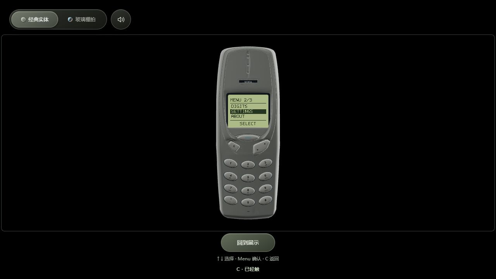

# 2026-10-04 屏幕菜单版发布

站点：[daidainiao.online](https://daidainiao.online/)。本次发布完成后，后续日历开发仍先在本地验证。

## 发布内容

- 版本：`20261004-screen-1`。
- 源码：`ac6d236e2936430140fcd36537a3bd07cedef3b9`，分支 `chore/local-build-workflow`。
- 展示／使用模式、自动旋转与固定操作视角、上下键独立输入、按键反馈。
- 84 × 64 点阵屏、数字输入、主菜单、设置、关于、C 删除／返回、主题与声音同步。
- 发布包含 21 份运行资源及构建清单，不含 Blender 工程或参考资料。

## 发布与验证

沿用 SSH `oracle`、Caddy 和现有域名配置。上传包 SHA-256：

`a61c901be93f36ed6d0c583efcac68eb72fbf443a7682c9606c596e274b76664`

逐项检查上传包、目录内实际文件和构建清单后，原子切换 `/srv/daidainiao.online`：

- 新目录：`/srv/daidainiao-releases/nokia3310-screen-20261004-ac6d236`。
- 保留旧目录：`/srv/daidainiao-releases/nokia3310-feedback-20261004-cf390c6`。

源站首页哈希与本地一致，Caddy 为 active。公网浏览器读取的 21 份资源均返回 200 且哈希匹配；HTML 仅去除既有 Cloudflare beacon 后比对。浏览器实际验证了“开始使用 → Menu → 向下选择 → 设置 → C 返回主菜单”，返回后保留设置项选中状态，使用模式自动旋转关闭。

发布前本地检查：9 项 Python、25 项 Node 测试通过。精确文件哈希、公网验证和时间见[发布快照](../web/release-snapshots/20261004-screen.json)。本次未进行真实移动设备或并发容量测试。



## 回退

只有确需回退本次发布且入口仍指向上述新目录时执行，保留两个发布目录。

```sh
ssh oracle
readlink -f /srv/daidainiao.online
sudo ln -s /srv/daidainiao-releases/nokia3310-feedback-20261004-cf390c6 /srv/daidainiao.online-rollback-screen-20261004
sudo mv -Tf /srv/daidainiao.online-rollback-screen-20261004 /srv/daidainiao.online
```

若创建链接失败，应停止检查，不继续执行替换。若已发布后续版本，应先阅读后续记录。切回后重新验证首页和资源。
