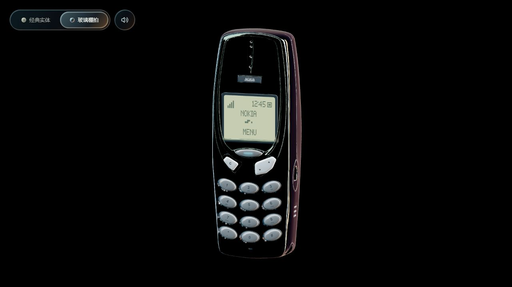

# 2026-10-04 发布与回退记录

网站：[https://daidainiao.online/](https://daidainiao.online/)。北京时间 2026-10-04 16:34 完成线上验收。

## 版本

- 网页版本：`20261004-feedback-3`。
- 源码提交：[`cf390c689e16a7eced92ab54e45edace86d7bc03`](https://github.com/xiaogoulingdi/Nokia3310/commit/cf390c689e16a7eced92ab54e45edace86d7bc03)。
- Git 分支：`chore/local-build-workflow`，已推送到 GitHub；本次未合并 `main`。
- 内容：v2 模型和功能键修正、经典实体／玻璃棚拍主题、按键行程增加 35%、局部明暗与两种短音、静音按钮及偏好记忆。
- 发布包仅包含 `web/dist/` 内的 16 份运行资源和构建清单。Blender 工程、参考图片、开发脚本未放入公开网站目录。

## 服务器与发布方式

沿用 SSH 别名 `oracle` 对应的现有甲骨文 VPS，服务为 Caddy。

- 站点入口：`/srv/daidainiao.online`，符号链接。
- 当前发布目录：`/srv/daidainiao-releases/nokia3310-feedback-20261004-cf390c6`。
- 上一发布目录：`/srv/daidainiao-releases/nokia3310-black-20261003T080218Z`，完整保留。

上传包的 SHA-256 为 `4d16683978849a02643057d133d1b6bbf80fc51cbde3ce3f73a05c513e0b0a41`。上传后先核对包哈希、解包路径以及全部资源哈希，再通过原子替换符号链接切换站点。未修改 Caddy、DNS 或防火墙配置，也无需重启服务。切换步骤包含源站首页检查，检查失败会恢复旧链接；实际检查已通过。

Cloudflare 对部分静态文件有缓存。本次给页面入口、业务模块、模型和棚拍配置统一加入版本参数，防止新旧资源混用。下次发布应同步更新 `web/index.html` 和 `web/app.js` 的版本标记。

## 验证结果

- 本地构建及依赖校验通过；9 项 Python 构建测试、4 项 Node 按键测试通过。
- 服务器发布目录内 16 份运行资源的大小与 SHA-256 全部匹配本地构建，源站首页匹配。
- 真实浏览器通过公网域名加载，两种主题切换正常；实体主题数字 5 和玻璃主题 Clear 的按键音均实际启动，静音后的点击不增加音频播放次数，随后恢复声音开启。
- 公网浏览器读取的 15 份非 HTML 资源哈希均与本地构建一致。Cloudflare 给 HTML 加入了既有的分析脚本；仅去除该明确识别的脚本后，HTML 的大小和 SHA-256 也完全一致。没有关闭或更改分析功能。
- `https://www.daidainiao.online/` 返回 301，跳转至主域名；Caddy 状态为 active。
- Windows Python HTTPS 客户端曾遇到握手异常，Python 请求也受到 403 响应；最终资源验收采用实际浏览器的 HTTPS 请求，不以失败的命令行请求作为验收证据。

详细数据：[发布快照与验证 JSON](../web/release-snapshots/20261004-feedback.json)。本记录未声称完成真实手机硬件性能测试或主观音质验收。



## 回退到上一版

只有在确认需要回退本次发布时才执行。先连接服务器并检查当前入口：

```sh
ssh oracle
readlink -f /srv/daidainiao.online
```

若仍指向本记录中的 `nokia3310-feedback-20261004-cf390c6`，可在服务器上执行：

```sh
sudo ln -s /srv/daidainiao-releases/nokia3310-black-20261003T080218Z /srv/daidainiao.online-rollback-20261004
sudo mv -Tf /srv/daidainiao.online-rollback-20261004 /srv/daidainiao.online
```

若第一条命令失败，应停止并检查，不要继续第二条；若当前目录已经是后续版本，也应先查看后续发布记录。回退后重新核对首页与资源，不删除任一发布目录。
