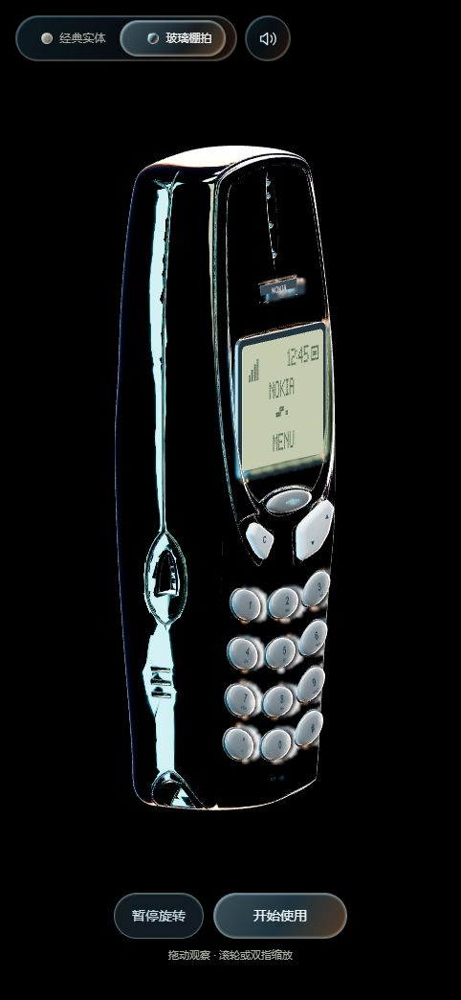
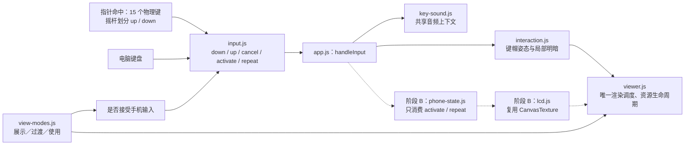
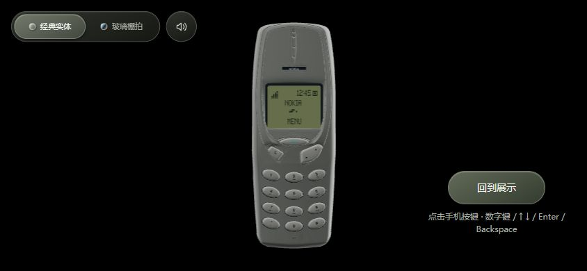

# 阶段 A：展示／使用模式与统一输入

日期：2026-10-04。版本：`20261004-modes-1`。状态：**本地实现与桌面验证完成，尚未部署上线；真实手机待验收。**

此阶段代码已保存为 Git 提交 `2b4a056`。本文保留当时 LCD 尚未接入的验收结果；后续动态屏幕见 [阶段 B1](阶段B1-屏幕与菜单.md)。

## 使用方式

双击项目根目录的 `启动本地预览.cmd`；本次开发预览服务在 [127.0.0.1:8010](http://127.0.0.1:8010/)。以后双击启动时以终端显示的端口为准。

1. 进入页面自动缓慢旋转，可拖动、缩放，也可以暂停旋转。
2. 点击“开始使用”，约 420 ms 转到固定正面；此时旋转和缩放锁定。
3. 按住数字或功能键可保持压下，松开回弹并确认一次；摇杆上／下两端分别倾斜。
4. 方向键按住 400 ms 开始重复，每 120 ms 一次；首次重复发声，松开不追加动作。
5. “回到展示”恢复刚才的展示角度和缩放。主题、声音与模式独立。

键盘仅在手机操作区聚焦时生效：`0–9`、`*`、`#`、`↑`、`↓`、`Enter → Menu`、`Backspace → C`。Tab 保留正常焦点移动，Ctrl／Alt／Meta 快捷键不被手机输入拦截。

LCD 保持原先静态几何，时钟和菜单暂不响应输入；页面底部临时提示接受的逻辑键。这是阶段 A 的明确边界。

## 模块与下一阶段接口

`input.js` 的状态规则不依赖 Three.js、账户、音频或具体应用。`app.js` 在接受动作处连接未来手机状态；动态 LCD 只读取状态并请求重画。切换模式不重建模型、渲染器或输入监听。

当前射线只检查 15 个实际键帽。摇杆的命中与倾斜依据 GLB 中两个箭头的位置校准，中间约 0.003 模型单位作为无效区。方向在按下时锁定；跨区、移出、移动超过 12 px、取消、失焦或第二个触点都会取消本次输入。

## 已验证结果

完整诊断数据见 [phase-a-validation.json](../web/tests/phase-a-validation.json)。

| 检查 | 结果与证据边界 |
| --- | --- |
| 自动化测试 | 9 项 Python 构建测试、15 项 Node 交互与模式测试通过 |
| 实际 GLB | 验证 15 个键的行程、稳定保持、精确复位；上下倾斜方向相反，原动画数据不被改写 |
| 浏览器点击 | 16 个逻辑键各点击一次，每个恰好记录一次动作 |
| 连续输入 | 100 次快速点击产生 100 次动作，结束后全部按键复位 |
| 普通键长按 | 行程保持稳定，稳定后 800 ms 内新增渲染帧为 0；松开只确认一次 |
| 方向重复 | 约 310 ms 前无重复，约 810 ms 时已有 4 次；松开没有追加动作 |
| 取消 | 移出、跨摇杆半区、中央无效区不提交动作；触摸、多指、失捕获、原生键盘重复另由 DOM 适配层测试覆盖 |
| 固定视角 | 使用时实际拖动和滚轮不改变相机；侧面／背面进入后归位正面 |
| 恢复姿态 | 浏览器中背面位置返回误差为 0；单元测试另覆盖正面、背面、侧面及缩放恢复 |
| 资源复用 | 两主题预热后，连续切换 20 次：几何 59→59，纹理 3→3，着色程序 6→6 |
| 静止与减少动态效果 | 使用模式 1 秒内新增帧为 0；暂停展示及减少动态效果时也停止持续绘制 |
| 生命周期 | 注入 blur/focus 检查取消按键、清空重复计时、暂停帧和恢复；隐藏过渡另有单元测试 |
| 声音 | 静音时播放数不增加；开启后增加一次，结束后声部为 0、上下文挂起；未重新进行主观试听 |
| 页面布局 | 默认桌面视口、320×740 竖屏和 844×390 横屏检查；窄屏及横屏无水平溢出 |
| 浏览器日志 | 本次检查没有警告或错误 |

资源数为 `renderer.info.memory` 的对象数量，并非占用字节；这次不报告设备帧率或总内存上限。稳定按住与静止休眠减少持续计算，不会自动释放仍需使用的 GPU 资源。

## 未验证项与后续工作

- 当前内置浏览器不支持触摸事件注入；触摸、多指取消有确定性的 DOM 适配层测试，但没有真实手机硬件结果。指尖能否方便区分摇杆两端、系统手势、声音自动播放及移动 GPU 表现仍需实机检查。
- 页面失焦集成测试通过开发诊断注入事件执行；未把它记作真实切换操作系统窗口的测试。
- 动态 LCD、菜单、设置、日历、小游戏、图片主题、账户和后端 API 均未在阶段 A 实现。
- 此阶段已保存为本地 Git 提交 `2b4a056`；已有线上发布与历史快照仍为单独记录。部署需按既有流程构建、上传与验收。

下一阶段先实现“数字输入 → LCD 出现数字”和“Menu → 菜单 → 上下选择 → C 返回”的闭环，再扩展应用。完整规划见 [阶段实施与多用户架构规划](阶段实施与多用户架构规划.md)。
