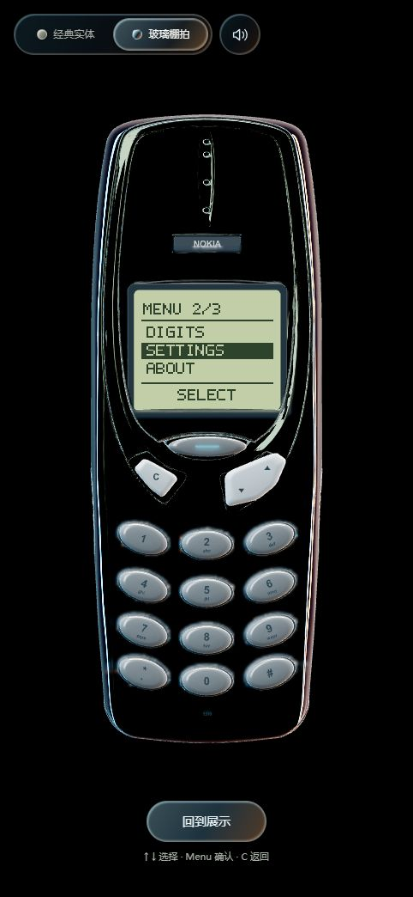
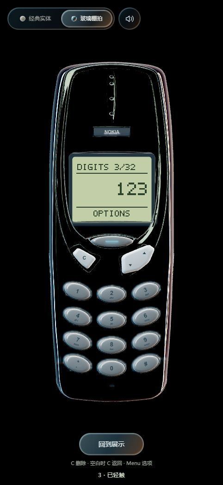
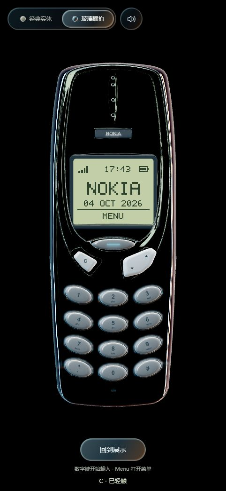
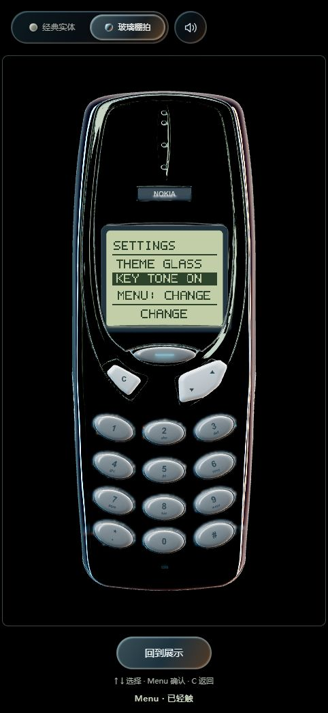
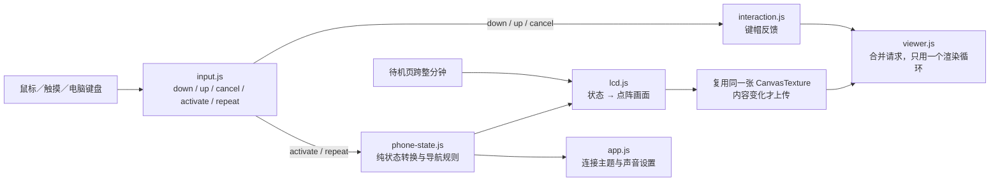
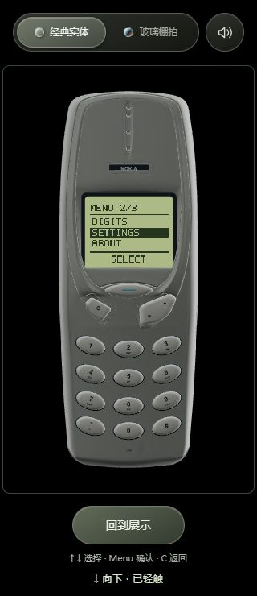

# 阶段 B1：动态 LCD、数字输入与菜单

日期：2026-10-04。当前本地版本：`20261004-screen-1`。阶段 A 已保存为 Git 提交 `2b4a056`；本页记录此后的屏幕功能，尚未部署线上。

## 实际操作

进入使用模式后，通过手机实体键或电脑键盘操作。电脑的 Enter 对应 Menu，Backspace 对应 C，上下方向键对应摇杆两端。

| 当前页面 | Menu | 上／下 | C | 数字、*、# |
| --- | --- | --- | --- | --- |
| 待机 | 打开主菜单 | 不改变页面 | 保持待机 | 开始一条新的输入 |
| 主菜单 | 进入选中项 | 循环选择 DIGITS / SETTINGS / ABOUT | 返回待机 | 不改变页面 |
| 数字输入 | 打开 OPTIONS | 不改变输入 | 删除一位；空白时返回待机 | 追加输入，最多 32 位 |
| 数字选项 | 确认 CLEAR ALL / MAIN MENU | 切换选项 | 返回数字页 | 不改变页面 |
| 设置 | 切换选中设置 | 切换主题／声音项 | 返回原菜单选中项 | 不改变页面 |
| 关于 | 返回菜单 | 不改变页面 | 返回原菜单选中项 | 不改变页面 |

数字页的 CLEAR ALL 清空输入，MAIN MENU 返回主菜单并保留草稿；从主菜单再次进入 DIGITS 可以继续编辑。回到待机后直接按数字则开始新输入，避免把新号码意外追加到隐藏草稿。

设置中的 THEME 对应左上角实体／玻璃开关，KEY TONE 对应声音按钮，两处状态同步。静音偏好沿用本机存储；数字草稿、菜单位置和材质主题为当前页面会话状态，刷新后重置。展示／使用切换保留当前应用页面。

屏幕采用简短英文点阵标签，页面提供中文操作提示及中文读屏摘要。状态栏的电量和信号图标为装饰，不读取实际设备状态；时间和日期来自访问者设备的本地时间。

## 显示基座与画面

本次将“显示基座”按手机内的 LCD 承载面处理，没有增加手机下方的展示底座。

- 保留现有 `Screen_Frame` 与圆角 `Screen_Display`，隐藏 `Screen_Preview_Pixels` 的静态文字。
- 增加一个只有两个三角形的 `LCD_Content` 显示平面，宽度为原显示面包围盒的 94%，高度按 84∶64 计算。它位于基座正面前方 0.00035 模型单位，保留正常深度测试与机身遮挡。
- 使用一张 **84×64 CanvasTexture** 和内置 5×7 字模；字形由整像素矩形绘制，最近邻采样，不生成 mipmap，也不加载外部字体。
- 显示平面采用独立 UV，方形像素不会被原模型近乎方形的屏幕强行拉长。84×64 是适配当前模型的网页布局，并非声称模拟原机 84×48 的硬件规格。
- 基座和内容使用不受棚拍曝光影响的基础材质；实体与玻璃主题分别有协调的 LCD 底色，字符保持深色高对比。外层模型的材质和灯光继续沿用现有配置。

## 模块与数据流

`phone-state.js` 不依赖 DOM、Three.js、声音、存储或账户。阶段 A 的 `activate / repeat` 是唯一业务动作入口，按下与松开不会被重复计算。`createPhoneState()` 可以实例化独立手机状态；未来日历或游戏遵循相同动作分发与生命周期约定。

`lcd.js` 拥有一份 Canvas、纹理、内容材质、基座材质和显示面几何。切换页面仅重画这张纹理。完整销毁时移除内容平面、释放所拥有的资源、恢复原基座材质及静态文字可见性；无需改写 GLB。

## 更新与性能边界

- 菜单、输入或设置变化时重画；重复传入同一状态不会更新纹理。
- 只有待机页安排一个跨分钟计时器；离开待机或页面失焦／隐藏时清除，恢复后从当前时间重算。
- 方向重复每 120 ms 最多确认一次，松开不额外移动菜单或重画屏幕。
- 数字长度限制为 32 位；没有无限输入历史、网络请求或每用户服务器实例。
- 84×64×4 = **21,504 字节**，仅是单份 RGBA8 像素载荷，不包含 Canvas、纹理、驱动或其他渲染资源开销。

## 验证

本次 **9 项 Python + 25 项 Node = 34 项测试全部通过**。新增测试覆盖菜单往返、数字删除与清空、32 位上限、重复动作过滤、设置同步、真实 GLB 的显示面布局、时钟调度、纹理复用、隐藏恢复与资源释放。

浏览器诊断见 [phase-b-validation.json](../web/tests/phase-b-validation.json)：

| 检查 | 结果 |
| --- | --- |
| 实体按键输入 | 显示 `123*#`，C 删除为 `123*` |
| 菜单与返回 | 进入设置、关于，再返回原菜单选中项；键盘 Backspace 返回有效 |
| 方向长按 | 约 780 ms 内确认 4 次重复；松开新增动作与 LCD 重画均为 0 |
| 设置同步 | 手机内切换主题／静音同步外部控件，外部声音按钮同步 LCD |
| 数字上限 | 长输入保持 32 位，显示 FULL 32/32；从待机新输入 8 得到独立的新草稿 |
| 50 次页面往返 | 主菜单→关于→C→主菜单，几何 59→59、纹理 4→4、程序 10→10 |
| 10 次模式切换 | 保留设置页面及状态，资源数量不增加 |
| 静止数字页 | 1 秒内新增渲染帧 0、LCD 重画 0，无待机时钟计时器 |
| 隐藏生命周期 | 合成 blur/focus 验证时钟计时器 true→false→true；跨分钟和释放由确定性单元测试覆盖 |
| 布局与日志 | 320×740 窄屏无水平溢出；本地浏览器未发现警告或错误 |

几何／纹理值是资源数量，不是 GPU 内存字节。此次没有真实手机硬件、触摸或 GPU 性能结果，也没有将单元测试的时间模拟称为真实跨分钟等待测试。

## 接下来的范围

此里程碑完成屏幕与按键的操作闭环。日历、贪吃蛇、图片主题、画质设置和账户同步仍按 [整体分阶段规划](阶段实施与多用户架构规划.md) 分批接入。当前数字输入用于本地交互体验，不接入真实通话服务。
