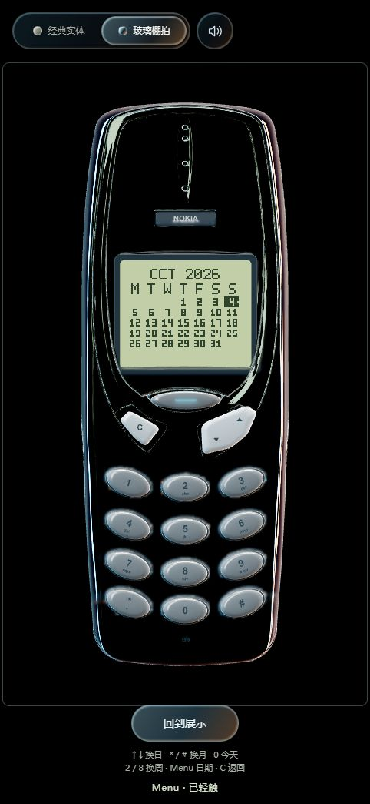
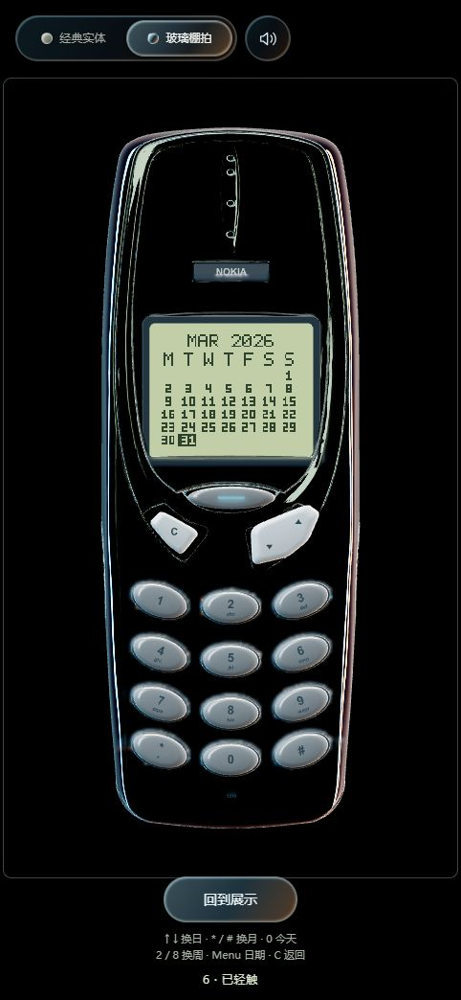
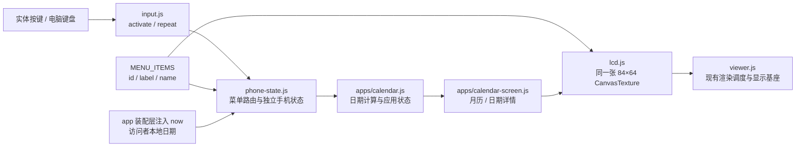

# 阶段 B2：第一个独立应用——日历

日期：2026-10-04。本文记录 `20261004-calendar-1` 的本地实现与验收。日历随后已随 `20261004-snake-1` 一起发布到 VPS，部署证据和浏览器验证边界见[日历与贪吃蛇发布记录](发布记录-20261004-贪吃蛇.md)；下文保留当时的本地截图和测试记录。

## 体验与操作

双击项目根目录的 `启动本地预览.cmd`，或在正在运行的本地预览中刷新。点“开始使用”，按 Menu 打开菜单，选择 **CALENDAR**，再按 Menu。

| 操作 | 功能 |
| --- | --- |
| 上／下摇杆；键盘 ↑／↓ | 前一天／后一天，按住连续选择 |
| 4／6 | 前一天／后一天 |
| 2／8 | 前一周／后一周 |
| *／# | 上月／下月；目标月没有相同日期时落在月底 |
| 0 | 回到电脑当前本地日期 |
| Menu；键盘 Enter | 月历与日期详情间切换 |
| C；键盘 Backspace | 详情 → 月历 → 主菜单 → 待机 |

月历以周一开始，一次显示完整六周空间，反白标出选中日期；今天旁边有一个小像素点，详情页明确显示 TODAY。星期标题沿用英文首字母，网页下方与屏幕阅读器提示为中文。当前日期依据访问者设备，不请求服务器时间。

月底换月采用截断规则，例如 `1 月 31 日 → 2 月 28 日 → 3 月 28 日`。日期运算支持公历 `0001-01-01` 至 `9999-12-31`，到边界停止；没有农历、节假日或日程提醒。返回主菜单、切换材质和展示模式会保留选中日期，刷新页面回到今天。跨午夜后下一次日历操作刷新“今天”标识，0 随时回到当前日期。




## 模块与数据流



- `calendar.js` 不依赖 DOM、Three.js、音效、账户或网络。状态只有 `selected`、`today`、`view`，日期为可序列化 `YYYY-MM-DD` 字符串。
- 公历运算使用 UTC 日期字段，显示的“今天”由本地日期生成；不通过本地毫秒数加减一天，避免夏令时误差。特殊处理 1～99 年，避免 JavaScript 构造函数自动加 1900。
- `calendar-screen.js` 只接收画矩形和文字等绘图方法。月历数字使用内置 3×5 字模，详情复用原有 5×7 字模，无字体下载、图片素材或文字网格。
- 菜单项来自同一个目录，不再分别维护导航、屏幕英文和中文提示三组索引。超过三项时显示三行窗口，随选中项滚动。
- 手机状态实例互相独立，返回状态和 onChange 回调复制嵌套日历数据，外部不能通过修改快照影响内部状态。未来存储／账户适配器可以保存每个实例的数据，当前没有增加用户后台。

## 资源与性能

复用原有 LCD CanvasTexture 和材质，两个新模块没有定时器、动画循环或网络请求。显示不变时不上传纹理；按键释放、相机停止后仍由既有按需调度停止绘制。84×64 的 RGBA 原始像素数据为 21 KiB，这张缓冲本来就存在，不是新增开销。

浏览器检查：实体主题为 59 个 geometry / 3 张 texture，玻璃主题预热后为 59 / 4；日历翻页和进出不增加资源数量。静止采样期间 renderCount 与 LCD draws 均未增长。这里是资源数量和调度证据，不是设备总内存测量或移动硬件帧率承诺。

## 验证

先构建，再运行：

```sh
python web/build.py
python -m unittest discover -s web/tests -p 'test_*.py'
node --test web/tests/test_feedback.mjs web/tests/test_input.mjs web/tests/test_input_dom.mjs web/tests/test_modes.mjs web/tests/test_phone.mjs web/tests/test_lcd.mjs web/tests/test_calendar.mjs
```

9 项 Python + 33 项 Node，共 **42 项通过**。新增覆盖：闰年与世纪、跨月跨年、夏令时边界、月底截断、六周月历、日期范围边界、今日刷新、状态实例隔离、完整返回链路、画布边界与纹理复用。原按键、输入取消、设置、数字及显示基座测试继续通过。

真实浏览器验证鼠标点实体键、键盘选择、Menu／C 返回、主题切换和窄屏布局。记录在 [calendar-validation.json](../web/tests/calendar-validation.json)。这轮没有真实触屏设备测试，也没有实现用户日程编辑、持久化和云同步；后续可分别接入，当前可用日历不依赖这些功能。
