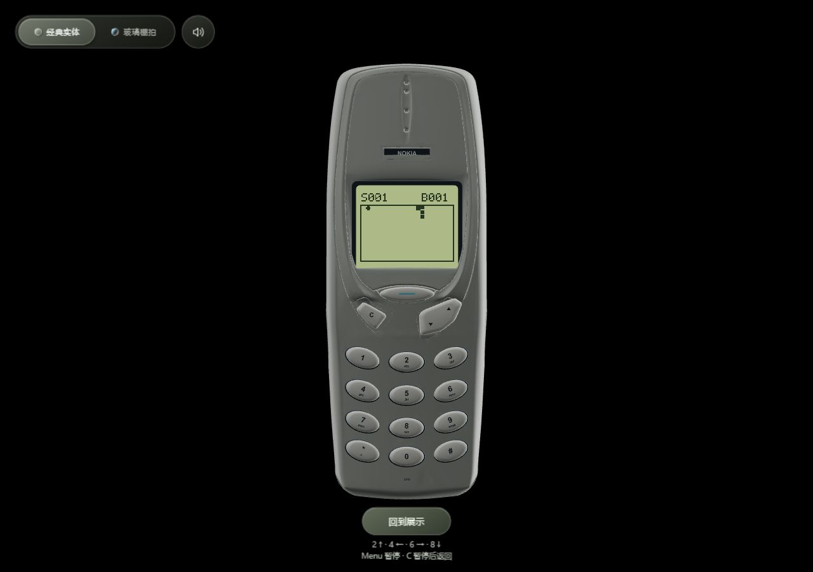
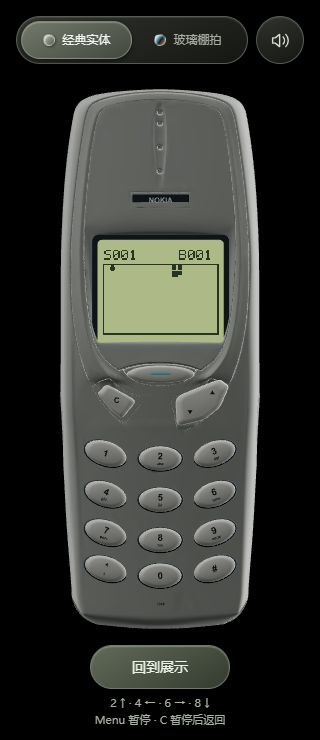
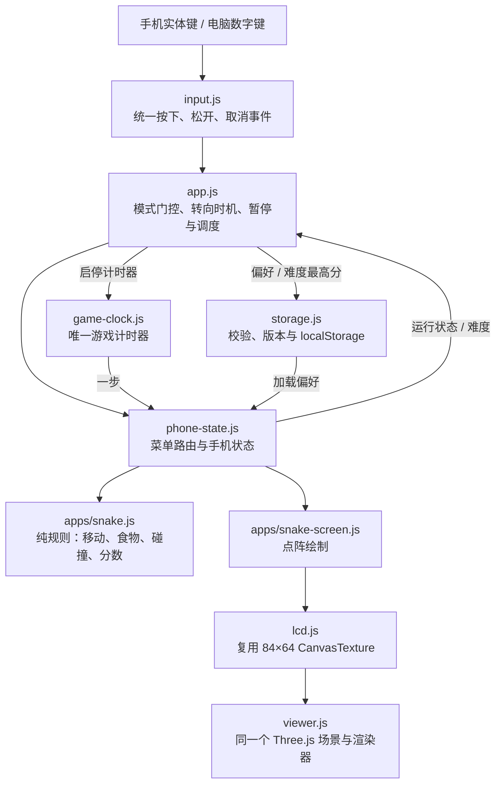

# 阶段 B2：手机屏幕内的贪吃蛇

日期：2026-10-04。版本：`20261004-snake-1`。状态：本地实现与验收完成，已发布到 VPS；公网资源核验通过，正式站点浏览器复验受本机连接中断影响，详见[发布记录](发布记录-20261004-贪吃蛇.md)。返回[项目总览](../README.md)。

游戏直接运行在三维手机的 LCD 内，用手机上的数字键或电脑数字键控制。使用模式会放大完整机身；页面不含额外游戏面板或方向按钮。

## 1. 怎样开始和操作

1. 点击页面“开始使用”，手机转到正面并锁定视角。
2. 按屏幕下方的 Menu 键打开菜单，用手机上下摇杆选择 `GAMES`，Menu 确认。
3. 在 `SNAKE` 上按 Menu 进入准备界面。上下选择 `EASY`、`NORMAL`、`FAST`，再按 Menu 开始。
4. 游戏中按 **2 上、4 左、6 右、8 下**。蛇会自动向前走，不用一直按住。

| 操作 | 手机模型按键 | 电脑键盘 |
| --- | --- | --- |
| 选择菜单、准备时选择难度 | 右侧摇杆上／下端 | ↑／↓ |
| 向上／左／右／下移动 | 2／4／6／8 | 2／4／6／8，含数字小键盘 |
| 开始、暂停、继续、结束后再玩 | Menu | Enter |
| 暂停；已暂停时返回游戏菜单 | C | Backspace |
| 暂停或结束时回准备界面 | 5 | 5 |

方向在**按下**时提交，松开不再重复转向。菜单仍在松开时确认。游戏不接受直接掉头；快速连续转弯最多缓存两次，每一步执行一个。摇杆和电脑上下方向键只在准备界面选择难度，不控制正在移动的蛇。

撞墙或撞到自身即结束，吃到食物得 1 分并增长一节；填满棋盘获胜。顶部 `S` 是本局得分，`B` 是当前难度最高分。EASY 每 360 ms 一步、NORMAL 每 260 ms、FAST 每 180 ms；蛇不会因得分而继续加速，三个难度分别记录最高分。标准档约每秒 3.85 格，适合看着手机屏幕操作。

切回展示模式、窗口失焦或页面隐藏都会暂停。回到页面后按 Menu 才继续，避免恢复时突然撞墙。C 返回游戏菜单后，本次会话仍保留暂停的棋盘，再进 SNAKE 可以继续；刷新页面则重新准备，只保留偏好和最高分。

## 2. 手机占比与点阵显示

使用模式按可用区域自动取景：手机包围盒最多占区域高度 **96%** 或宽度 **88%**，取先达到的限制。竖屏减少底部留白；矮横屏把主题、手机和退出控件分列。缩放不会改变模型几何，返回展示时恢复进入使用前的观察姿态和缩放。

以 1280×900 窗口为例，旧使用区域高 694 px，缩放 1.06；新使用区域高 714 px，缩放 1.1712。根据相同正交投影计算，手机线性显示尺寸约增加 **13.7%**。实际提升随窗口比例变化，窄长窗口还会触发宽度限制。

LCD 保留 **84×64** 方形像素，棋盘为 **20×12** 格，每格 4×4 像素。蛇头实心、蛇身留缝、食物使用十字形；顶部只放得分，剩余区域留给棋盘。显示基座、深度遮挡和两种材质主题继续复用。

提高纹理分辨率本身不会增大网页中的屏幕或可点击键帽，因此这一版优先放大手机。后续若需要更精细的字体或图片主题，可再独立调整逻辑画布与字模；不要只放大纹理后把文字和游戏格子缩小。

## 3. 模块与数据流

`snake.js` 不访问 DOM、计时器、存储或网络，随机值由外部注入。空格列表决定食物位置，填满时直接获胜，不反复随机尝试。返回的状态不修改旧状态；手机状态快照复制蛇身、食物、转向队列和最高分，避免多个实例相互污染。

`game-clock.js` 同时最多维护一个 timeout，状态通知不会重复创建计时器。暂停或退出时清除，恢复后不追赶后台经过的时间。只有运行时每一步更新 LCD 并请求现有 Three.js 渲染；按键回弹继续使用原有短动画，没有第二个三维场景、屏幕纹理或持续游戏渲染循环。

## 4. 存储与后续账户

本机存储键为 `nokia3310.preferences.v1`，保存版本、主题、静音偏好、难度，以及三个难度的最高分。只有这些值改变才写入，普通移动不会写 localStorage。兼容旧的 `nokia3310.sound-enabled`；无效 JSON、未知版本或不合法分数会回退，存储被禁用或容量不足时仍能在本次会话使用。

游戏运行、计时与按键不请求 VPS。当前记录仅属于这个浏览器和站点来源；`localhost`、`127.0.0.1`、不同端口与线上域名的记录互不共享，也不是经过服务端认证的排行榜成绩。

将来添加账户时，可以把存储适配层扩展为读取／保存个人设置与记录，不需给每个用户常驻独立手机进程或单独划分 VPS 内存。账户鉴权、同步冲突与排行榜防篡改仍是后续独立工作。

## 5. 已验证与边界

- **48 项 Node + 9 项 Python 测试通过**。新增覆盖转向防反向、快速转弯队列、碰撞、尾格移动、满棋盘、暂停与重开、独立实例、所有难度的 LCD 边界、单计时器、存储校验与失败降级；原菜单、日历、输入、模型与构建测试继续通过。
- 桌面浏览器实际点击模型 2／4／8／6，四次都只提交一个动作并正确转向；电脑数字键同样验证。窄屏模型点击和 C 暂停通过。
- 实际吃到食物后得分 1、蛇长 4、EASY 最高分 1，刷新后记录、主题与难度保留；撞墙结束、Menu 重开、C 返回与切回展示自动暂停通过。
- 模拟 window blur/focus 事件后，暂停且恢复焦点不自动继续。这是事件级验证，不是切换操作系统应用的实机测试。
- 暂停且键帽动画结束后观察 700 ms，游戏步数、LCD 绘制次数、三维渲染次数增量均为 0；玻璃主题资源为 59 个几何体、4 张纹理。资源计数不等于 GPU 内存字节数。
- 320×740、390×844、486×1050、568×320、1280×900 及 320×1100 视口检查无横向溢出，手机完整显示；浏览器未记录 warning/error。

原始记录：[snake-validation.json](../web/tests/snake-validation.json)。这些是本机 Chromium 的响应式视口和桌面交互检查，尚不代表真实手机触摸手感、帧率、温度或电池表现。小横屏里的机身仍然较小，试玩优先用竖屏或电脑数字键。

日历与贪吃蛇已随 `20261004-snake-1` 发布。上一版 `20261004-screen-1` 的目录已保留，可按发布记录回退。
