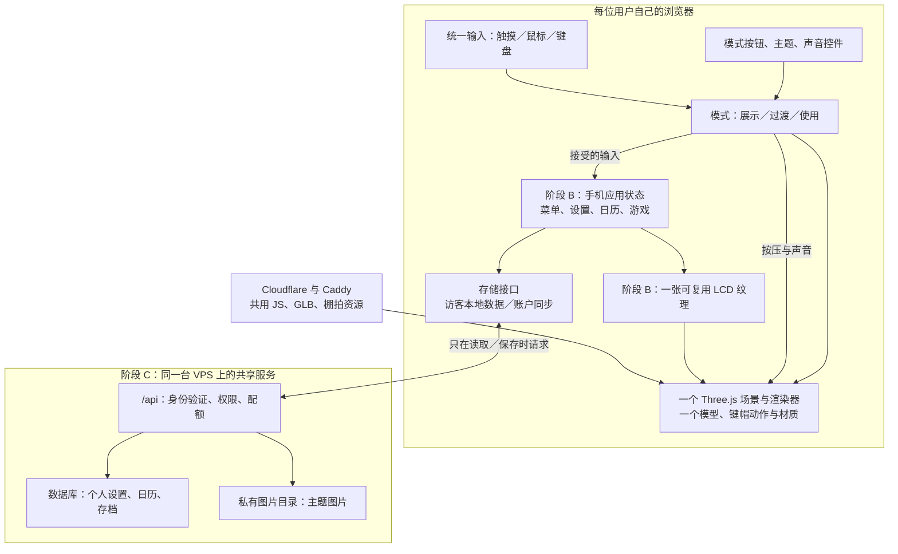
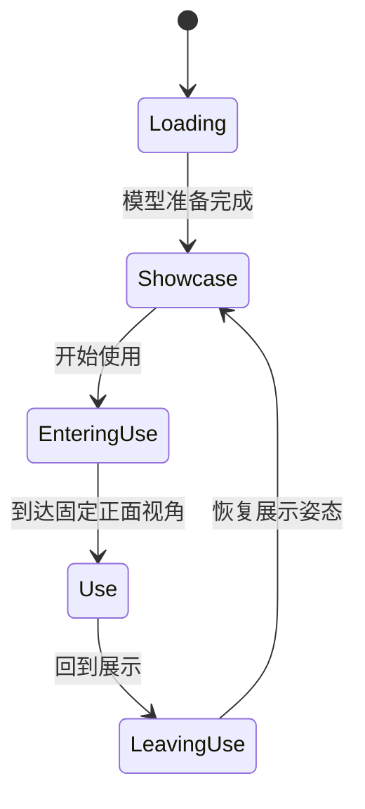

# 分阶段实施与多用户架构规划

日期：2026-10-04。状态：阶段 A 与 B1 屏幕基础流程已在本地实现，尚未部署；真实手机触摸与性能待验证。日历、游戏、图片主题及 C～D 仍为规划。返回 [项目总览](../README.md)。

本计划承接 [交互与性能规划](交互与性能规划.md)，以本次确认的顺序为准：先实现展示／使用模式与输入，再实现屏幕响应；未来功能围绕设置、日历、小游戏和图片主题展开。邮箱暂不纳入，用户上传三维手机模型也不列入当前计划。

## 1. 当前基线与阶段边界

已上线的基线是 `20261004-feedback-3`，源码提交 `cf390c6`，发布记录提交 `88e2134`。阶段 A 已保存为 `2b4a056`。本地 `20261004-screen-1` 在模式与输入基础上加入动态 LCD、数字输入、菜单、主题与声音设置；账户和后台 API 留待后续。证据见 [阶段 A](阶段A验收.md) 和 [阶段 B1](阶段B1-屏幕与菜单.md)。

| 阶段 | 交付内容 | 完成条件 |
| --- | --- | --- |
| A：模式与输入（本地已实现） | 模块整理；展示／过渡／使用；上下导航；按住与松开；鼠标、触摸及键盘统一输入 | 已通过自动化与桌面浏览器检查；屏幕静态，实机触摸与性能待验收 |
| B1：屏幕基础流程（本地已实现） | 动态 LCD、时钟、数字输入、菜单、主题与声音设置 | Menu 确认、上下选择、C 删除或返回；34 项自动化测试及浏览器验证通过 |
| B2：本地应用（待实现） | 日历、小游戏、图片主题、画质设置 | 复用同一状态与屏幕接口；应用完整进出、暂停与恢复 |
| C：账户与同步 | 注册登录、个人设置、日历与存档同步；图片主题上传 | 用户间不能互读互改；断网不阻塞本地按键；备份可恢复 |
| D：按实测扩展 | 容量压测、数据库／存储调整，确有需求时增加服务 | 根据响应时间、错误和资源占用判断，不以注册人数直接决定扩容 |

阶段 A 不引入账户数据库或登录依赖；先确定数据接口与模块边界，实际需要时再添加实现。各阶段分别验证和发布，保留上一个可用发布目录。

## 2. 总体架构：浏览器运行手机，VPS 保存用户数据



用户打开页面后，三维渲染、按键动作、声音与小游戏主要使用其设备的 CPU/GPU 和内存。VPS 提供公共文件，并在阶段 C 处理账户和数据请求。转动手机、按每一个键、每一帧游戏都不需要发送到服务器。

注册用户拥有独立数据和访问权限；服务器进程及基础模型文件可共享。不同浏览器各自拥有运行状态，服务器不为每个已注册用户常驻一台虚拟手机。

## 3. 模块划分与复用规则

### 3.1 阶段 A 的前端整理

沿用原生 JavaScript ES Modules 和现有 Three.js 版本。先保持一个前端项目，不为账户功能重写三维展示。

| 模块 | 单一职责 | 不负责的内容 |
| --- | --- | --- |
| `app.js` | 创建模块、连接回调、启动与销毁 | 不堆积拾取、账户与游戏规则 |
| `viewer.js`（新增） | 场景、模型、相机、尺寸、自带的唯一渲染调度与资源生命周期 | 不发起用户数据请求 |
| `view-modes.js`（新增） | 展示／使用状态及视角过渡，决定何时接受输入 | 不管理账户或菜单内容 |
| `input.js`（新增） | 指针、键盘、取消、按住与重复；输出统一事件 | 不直接修改 Three.js 对象或数据库 |
| `interaction.js`（整理现有） | 三维命中与物理键帽动作，提供上下命中区域及复位 | 不知道具体应用或当前登录用户 |
| `appearance.js`（保留） | 实体／玻璃材质、棚拍环境、局部明暗 | 不读写账户设置 |
| `key-sound.js`（已整理） | 音色、播放、静音与音频生命周期 | 按钮与本机偏好存储已移到装配层；不拥有用户身份 |
| `theme-switch.js`（保留） | 主题控件的 DOM 行为 | 不直接访问后端 |

模块暴露少量 `create…()`、`update()`、`dispose()` 等方法，状态保存在各实例内部；通过明确传入的函数连接，不建立全局“当前用户／当前手机”对象。暂不引入通用插件框架、大型事件总线或微服务。

每个监听器、ResizeObserver、定时器和渲染请求必须有所有者，销毁时解绑。切换展示／使用不重建模块，不重新下载模型。渲染只保留一条调度链。

### 3.2 屏幕模块与后续扩展

```text
web/
  app.js / viewer.js / view-modes.js / input.js
  interaction.js / appearance.js / key-sound.js / theme-switch.js
  phone-state.js        # B1 已实现：应用状态和动作规则，不依赖 Three.js
  lcd.js                # B1 已实现：状态到像素、显示面、唯一纹理与分钟计时器
  apps/                 # B2 待实现：calendar、snake 等应用；当前设置规则很小，仍在状态层
  storage.js            # B2 待实现：异步 load/save，先提供访客本地实现
  account.js            # 阶段 C：会话状态与 HTTP 同步适配
server/                 # 阶段 C 才创建
  app.js                # 一个共享 API 服务
  modules/auth/         # 身份和会话
  modules/profile/      # 设置、日历和存档
  modules/assets/       # 图片、配额和权限
  repositories/         # 数据访问，隔离 SQL 与路由
  migrations/           # 数据结构升级
```

标注已实现的文件已进入构建，其余仍为未来职责，不创建空目录或占位功能。现有 `build.py` 负责前端构建，新增模块需进入文件清单并同步资源版本；它不负责启动后端。阶段 C 的依赖单独锁定，前后端分别部署。

## 4. 阶段 A 的明确交互约定

### 4.1 模式



- 展示：缓慢自动旋转，可拖动观察；拖动期间暂停自动旋转，结束后再恢复。模式入口明确显示“开始使用”。
- 进入使用：清空按住状态，停止自动旋转及残留阻尼，再平滑对齐正面，当前设为 420 ms。减少动态效果时缩短到下一帧完成。
- 使用：固定便于辨认上下箭头和数字的视角；阶段 A 同时锁定旋转和缩放。点击只承担按键操作。
- 回到展示：释放所有按键，恢复展示姿态，重新启用观察操作。
- 过渡期间不接受手机业务输入，也不叠加多段切换动画；模式按钮按状态处理连续点击。
- 页面隐藏／失焦：取消输入并静音，隐藏时暂停绘制。可见性作为独立标志保存，恢复时延续原模式，不补播音效。
- 尊重减少动态效果偏好：展示不强制自转、过渡缩短；仍可手动观察并进入使用。

观察姿态必须由一个控制器负责。阶段 A 优先统一使用 OrbitControls 管理展示观察角度与自动旋转，模型内 `Showcase_Rotate` 不同时播放。过渡期间停止控制器对姿态的写入，完成后应用精确目标；需测试任意背面／侧面姿态都能正确进入正面使用。

主题与模式是独立状态：`theme = real | glass`，`mode = showcase | entering-use | use | leaving-use`。换主题不退出当前模式。

### 4.2 输入事件与上下键

统一事件建议形态：

```js
{
  key: 'up',                    // 0..9、star、hash、menu、clear、up、down
  physicalKey: 'Key_Scroll',
  phase: 'down',                // down、up、cancel、activate、repeat
  source: 'pointer',            // pointer、keyboard、accessible-control
  time: 1234.5                  // 单调时钟，仅本次会话使用
}
```

`down` 立刻开始视觉压下，`up` 触发回弹；`activate` 才代表一次被接受的短按。方向键按住可产生 `repeat`；重复发生后松开不再额外提交短按。应用只消费动作，不把 `down` 和 `activate` 都算作一次输入。

- 15 个物理按键映射为 16 个逻辑按键，其中 `Key_Scroll` 共用一体式键帽，但区分 `up`、`down`。
- 在键帽自身坐标中按两个箭头划分命中区域，中间保留很窄的无效区。按下时锁定该方向，滑到另一端应取消本次输入，不能自动改成相反方向。
- 上端／下端分别轻微倾斜；转轴依据当前模型校准。数字键与其他功能键改为可保持的压下进度。
- 同一节点只由一种动画方式写入；接入按住动作时停止对它播放旧的整段 `Press_*` 动画，仍可从原轨道获取行程方向和范围。
- 当前直接拾取 15 个实际键帽，不遍历机身，也不增加代理几何；固定正面使用模式避免从背面误触。若以后扩大触摸热区，需检查邻键重叠。
- 鼠标、触摸和电脑键盘经过同一套逻辑。只在手机操作区获得焦点且处于使用模式时接收键盘输入，不抢占表单或主题／模式按钮的键盘操作。
- 已接入数字键、*、#、↑↓、Enter→Menu、Backspace→C；Tab 保持正常焦点移动，不吞掉 Ctrl／Alt／Meta 组合键。
- 指针取消、失去捕获、失焦、隐藏或退出使用模式时，统一取消手势、重复计时和键帽状态。
- 重复导航采用按住 400 ms 后开始、每 120 ms 一次，B1 已接入菜单。当前 C 在数字页删除一位，空白时返回待机，在其他页面返回上一级；长按 C 暂无额外动作。
- 每次被接受的短按播放一次短音，重复导航默认不逐次叠加声音；沿用现有声音开关。

### 4.3 阶段 A 验收

1. 从正面、侧面、背面进入使用，都归位正确；使用时拖动不能旋转或缩放。
2. 连续切换 20 次不增加模型、几何和纹理数量；一次性着色器预热单独记录。
3. 上下半区鼠标／触摸／键盘对应正确，键帽倾斜方向不同，中央边界及跨区拖动不误触。
4. 短按恰好一个动作；长按重复释放后不多出一次动作；快速连续按键不卡住。
5. 按住时切模式、切标签页、失焦、多点触摸或取消，都能复位且不补播声音。
6. 使用模式静止时没有持续主动绘制；展示旋转期间允许持续绘制，隐藏时停止。
7. 两种主题保持材质一致，静音正常；检查当前 Windows 浏览器和至少一个真实手机，窄窗口只算布局验证。

当前完成情况、资源计数与未验证项见 [阶段 A 验收](阶段A验收.md)。24 项自动化测试和本地桌面浏览器检查已通过；第 7 条中的真实手机仍未验证，不把桌面窄窗口或合成 Pointer Events 计作实机结果。

## 5. 阶段 B：屏幕和本地功能

B1 已完成待机→菜单→设置／数字输入→返回的完整路径。LCD 复用一张 84×64 CanvasTexture，隐藏旧静态文字，在原圆角基座上使用保持像素比例的独立显示面，不为每页新建纹理或每个字符创建三维对象。详见 [B1 实现与验收](阶段B1-屏幕与菜单.md)。下表其余应用、画质和背景选择仍待 B2 实现。

| 功能 | 首版范围 | 后续同步的数据 |
| --- | --- | --- |
| 设置 | 主题、声音、画质、背景选择 | 小型偏好对象 |
| 日历 | 月历与日期查看；需要时添加个人事项 | 有所属用户的事件；明确全天日期或时间／时区 |
| 游戏 | 先做贪吃蛇，具有开始、暂停、重开 | 最高分、必要存档，不逐帧上传 |
| 图片主题 | 优先网页背景；屏幕接入后再适配壁纸 | 图片资源 ID 与裁剪方式，不存 base64 到设置中 |

当前 LCD 的复古单色风格不适合直接展示任意彩色照片；后续屏幕壁纸需选择保留单色点阵转换，或增加明确的现代显示风格。网页背景不受这个限制。

手机按键操作和应用状态留在本地。时钟显示分钟时按分钟更新，菜单变化才重画；游戏逻辑固定步长，页面隐藏时暂停。设置和日历保存做合并／节流，不能每帧写盘或发送请求。

## 6. 阶段 C：多用户服务与数据隔离

### 6.1 初始技术选择

建议在现有 Caddy 后增加一个 Node.js 活跃 LTS + Fastify 服务，以同域 `/api/` 提供接口。Fastify 的模块作用域便于将身份、个人资料、图片管理分开；这里只是选型建议，未安装或锁定新依赖。[官方插件机制](https://fastify.dev/docs/latest/Reference/Plugins/)

在单台 VPS、低频设置／日历／存档写入的前提下，首版可采用 SQLite WAL，减少一个数据库服务的运维成本。数据库文件放本机持久目录，事务尽量短；WAL 允许读写更好地并行，但同一数据库仍只有一个同时写入者。若出现持续写入排队、需要多实例 API 或更复杂报表，再评估 PostgreSQL；通过数据访问模块和迁移脚本控制变更，不能承诺替换数据库零改动。[SQLite 适用场景](https://www.sqlite.org/whentouse.html)、[WAL 说明](https://www.sqlite.org/wal.html)

### 6.2 数据归属

建议最初使用 `users`、`sessions`、`preferences`、`calendar_events`、`app_saves` 和 `assets` 几类表。后三类及设置数据都有 `user_id`；存档按 `user_id + app_id` 唯一，图片记录包含所属用户、类型、大小与保存路径。

服务端从验证过的会话取得用户 ID，在每一次查询、修改和图片下载时检查归属。不能相信前端传来的 `user_id`，也不能只通过随机文件名实现隔离。注册人数不会等于常驻进程数。[OWASP 授权建议](https://cheatsheetseries.owasp.org/cheatsheets/Authorization_Cheat_Sheet.html)

共享基础手机 GLB 和公共环境资源；按用户保存偏好和资源引用，不给每个账户复制一份模型。

建议接口以 `/api/me/preferences`、`/api/me/calendar`、`/api/me/saves/:appId` 和 `/api/me/assets` 为主。写入携带预期版本号，冲突时提示或合并，而不是悄悄覆盖另一设备的更新。API 只返回必要字段并限制正文大小。

### 6.3 会话与客户端状态

- 登录会话优先使用同域 `HttpOnly + Secure + SameSite` Cookie；敏感写操作验证来源并配置 CSRF 防护，退出时使会话失效。账户 API 和私有图片明确禁止共享 CDN 缓存。[会话管理依据](https://cheatsheetseries.owasp.org/cheatsheets/Session_Management_Cheat_Sheet.html)
- 密码通过维护中的库执行 Argon2id 等适当的密码哈希，具体参数按机器实测选择；不自行设计加密，不将凭据放进前端存储或日志。[密码存储依据](https://cheatsheetseries.owasp.org/cheatsheets/Password_Storage_Cheat_Sheet.html)
- 访客保留本地设置；登录后可以明确选择是否导入访客数据，不能自动覆盖现有云端存档。
- 本地缓存按访客／账户命名隔离；切换账户或退出时清空当前账户在内存中的私有数据、取消尚未完成的请求，旧请求不能回写到新账户。
- 断网时继续操作手机；同步状态显示“待同步／失败”，不能将失败当保存成功。保存队列需有条数和大小限制。
- 可玩内容允许访客使用，账户用于同步和个人存储，不让每次按键依赖登录服务器。

### 6.4 图片主题

“上传手机模型”指替换整部手机的三维几何、材质和按键节点，会引入格式、节点约定、资源预算与兼容验证，目前不做。图片主题只改变背景或未来壁纸，复杂度小得多。

可先做浏览器本地选图预览，账户阶段再做上传与跨设备保存。以下数字是待压测调整的初始策略：

- 只接收 JPEG／PNG／WebP 等允许的位图；单文件上限暂定 5 MiB、解码像素数上限 1600 万，主题成品最长边 1600 像素。
- 浏览器可先缩图降低上传量，但服务端仍需重新验证真实格式、尺寸并重新编码，去掉不必要元数据；浏览器检查不能代替服务端检查。
- 图片处理最初只允许一个任务同时解码，避免多张图片的中间缓冲同时撑高内存；失败任务有超时和清理。
- 每用户暂定保存最多 10 张、合计 20 MiB 的处理后图片。配额由服务端计算并检查，同时限定上传请求频率与全站存储上限。
- 图片保存在独立持久目录，通过资产 ID 引用；不放在 `web/dist/` 或版本发布目录，避免发布／回退丢失用户文件。
- 私有图片由服务端校验所有权后返回；公开分享另设明确可见性，不默认把用户原图放到公共 CDN。

## 7. VPS 是否支持，是否按用户分内存

### 7.1 实测配置

2026-10-04 16:44:57（北京时间）通过既有 `ssh oracle` 只读检查：

| 项目 | 实测 |
| --- | --- |
| CPU | ARM64／Neoverse-N1，2 个核心、2 个逻辑 CPU |
| 物理内存 | 12,506,755,072 字节，约 11.65 GiB |
| 当时系统已用内存 | 660,176,896 字节，约 630 MiB |
| 当时可用内存 | 11,846,578,176 字节，约 11.03 GiB；含可回收缓存 |
| 系统盘 | 总计约 192.69 GiB，可用约 187.87 GiB |
| 负载 | 本次前一采样的 1／5／15 分钟负载为 0.00／0.00／0.00 |
| 服务 | Caddy active；Docker 相关服务已运行 |
| 资源控制 | cgroup 控制器包含 `cpu`、`memory`、`io`、`pids` |

这是当前空闲站点的容量快照，不是压力测试；也不是 Oracle 免费额度、资费或未来可用容量承诺。

**判断：现有机器适合作为“静态三维手机 + 小型账户 API + 设置／日历／游戏存档 + 有配额图片主题”的起步服务器。没有必要因为规划多用户就先升级 VPS。** 同时在线上限要在后台实现后测量，不能用内存总量除以假定“每用户内存”得出。

### 7.2 分什么资源

| 层面 | 建议方式 |
| --- | --- |
| 运行内存与 CPU | 给整个 API 服务和图片处理任务设置上限，用户请求在其中共享执行 |
| 用户数据 | 数据库以 `user_id` 隔离，每次服务端验证归属 |
| 图片与存档空间 | 按账户限制总字节数、数量和单文件大小 |
| 接口调用 | 按账户与 IP 分别限流，注册／登录／上传比普通读取更严格 |
| 任务资源 | 限制图片解码等重任务的全局并发数；以后有 AI 任务再单独排队 |
| 公共模型 | 一个发布版本共享使用，浏览器和 CDN 缓存 |

不建议给每位用户长期预留 100 MiB 或启动独立容器：离线账户也会占预算，服务副本和进程开销会重复，不能解决应用层的数据权限。普通账户、日历和小游戏不需要此方案。

这台 Linux VPS 具备按服务／容器限制 CPU 和内存的基础条件。Docker 的内存硬上限是约束而非预分配；达到上限可能终止进程，应先测服务基线再设值。[Docker 资源限制说明](https://docs.docker.com/engine/containers/resource_constraints/)

账户服务上线前，可把 API 的 **512 MiB～1 GiB** 上限作为压测起点，而非已验证的生产参数；另外给操作系统、Caddy、数据库缓存、图片处理和波动留余量。这里的限额针对整个服务，不按每个用户重复分配，也不能拿 `--max-old-space-size` 代替完整进程内存限制。

只有未来变成运行用户代码、远程桌面、云端三维渲染等产品，才需要重新评估用户级运行沙箱。这超出当前复古手机的范围，不能沿用本次轻量服务容量判断。

### 7.3 容量验收与运维

注册人数、同时在线人数和每秒请求数分别统计：100 人各自在浏览器玩游戏，可以很少请求 API；集中登录／上传则可能短时占满 CPU。CPU 密集的密码哈希和图片解码尤其需要控制并发。

阶段 C 在隔离测试数据上分别模拟 10／50／100 并发的设置读取、存档保存、登录及少量上传，测 p95 响应、错误率、CPU、RSS、磁盘与 SQLite 写入等待。它们是测试梯度，不是当前支持人数的承诺。逐级增加压力并设置停止阈值，避免直接压垮正式站点。

用户数据的备份与静态发布回退分开管理；数据库使用支持一致性的备份方式，SQLite WAL 运行期间不只复制主数据库文件。备份保留在独立位置并做恢复检查；后续备份目的地与保留周期另定。已有站点的版本目录回退只能恢复代码，不能自动恢复用户数据。

## 8. 下一次开发的交付范围

阶段 A 与 B1 已完成本地实现。下一步体验现有菜单、输入和显示基座，再按优先级接日历或贪吃蛇；图片主题与画质设置分别设计。真实手机验收和上线发布各自单独记录。

账户服务的首个落点仍应是“设置同步”，验证身份和数据隔离后复用同一框架添加日历、存档及图片主题。邮箱保留为未来重新讨论的可选项。
